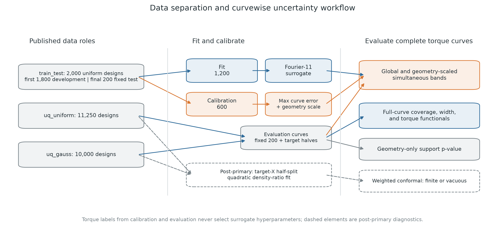
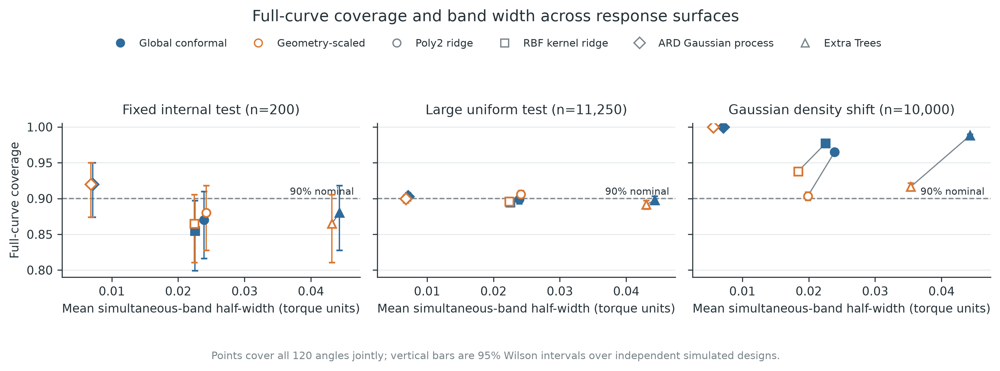
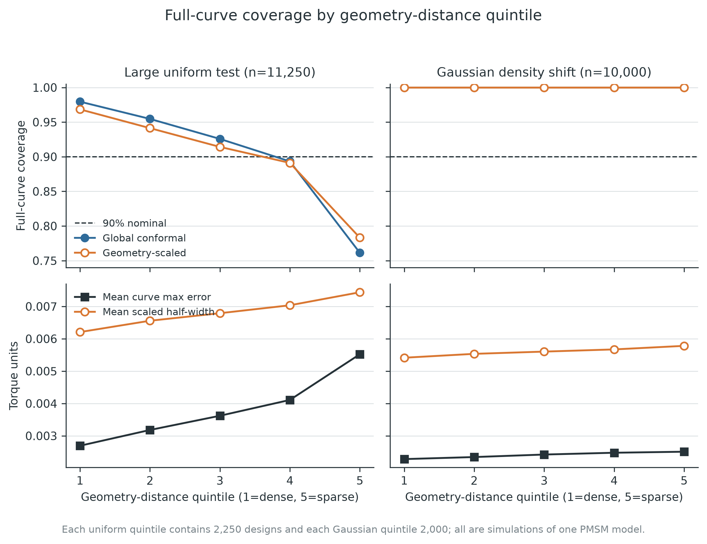
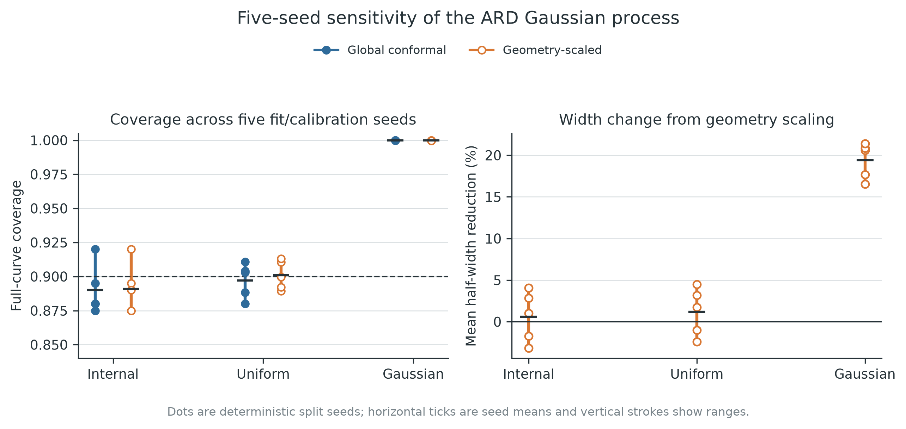
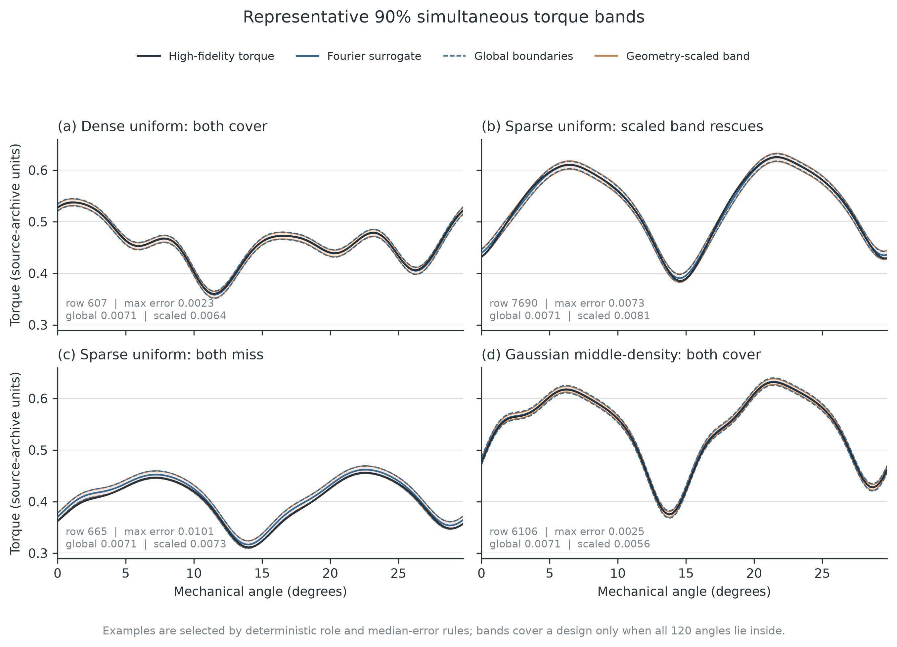

# Abstract

Surrogate accuracy averaged over rotation angles does not tell an electric-machine designer
whether an entire predicted torque period is reliable for a requested geometry. We study
simultaneous, curvewise uncertainty for a Fourier-reduced permanent-magnet synchronous
machine (PMSM) torque surrogate using 23,250 high-fidelity simulated
designs. Each design has 20 geometric inputs and 120 torque values over one 30-degree period.
An anisotropic Gaussian-process response surface predicts 11 retained Fourier components;
split conformal prediction then calibrates the maximum absolute error over all 120 angles.
We compare a constant-width global band with a label-free geometry-scaled band and attach a
nearest-neighbour support warning. On 11,250 independent uniform designs, the primary 90%
global and geometry-scaled bands achieved 90.29% and 89.96% full-curve coverage with mean
half-widths 0.00713 and 0.00681 source-archive torque units. Aggregate calibration concealed
a marked conditional failure: in the sparsest geometry-distance quintile, coverage fell to
76.13% and 78.31%, respectively. On 10,000 tightly concentrated Gaussian designs, both bands
covered 100% of curves, and geometry scaling reduced mean half-width by 21.4%. A post-primary
estimated weighted-conformal diagnostic exposed a different limitation. The Gaussian target
was perfectly separable from the source by geometry alone, the calibration-weight effective
sample size collapsed to 4.31 of 600, and every weighted band was vacuous. These results show
that marginal curvewise calibration, local design-space conditioning, geometric support, and
source--target density overlap are distinct engineering questions. The study provides a
reproducible benchmark and failure audit, but it does not quantify simulator
model-form error, manufacturing variation, another machine topology, or hardware uncertainty.

**Keywords:** permanent-magnet synchronous machine; surrogate model; conformal prediction;
torque ripple; covariate shift; uncertainty quantification

# 1. Introduction

Geometry exploration for electric machines repeatedly evaluates electromagnetic models at
candidate designs. High-fidelity field models are accurate enough to serve as design tools,
but their computational cost makes large parameter studies and Monte Carlo uncertainty
quantification expensive. Reduced-order response surfaces address this bottleneck by mapping
geometry to a compact representation of the quantity of interest. For periodic PMSM torque,
Fourier reduction is particularly natural: the signal is periodic, a small number of
frequency components retains its dominant physical structure, and the full curve can be
reconstructed after regression [@partovizadeh2025fourierpmsm].

Prediction accuracy is only one part of the design decision. A low mean absolute or percentage
error can coexist with a localized miss at the angle that defines peak torque or torque
ripple. Likewise, a surrogate can reproduce population-level means and standard deviations
while being unreliable for an individual proposed geometry. A designer therefore needs an
answer to a different question: *for this geometry, does a prediction band contain the whole
torque period with a stated marginal frequency?* Anglewise intervals do not answer that
question, because 120 individually calibrated intervals need not cover all 120 angles
simultaneously.

Conformal prediction supplies model-agnostic marginal coverage under exchangeability
[@lei2018distributionfree; @angelopoulos2023conformal]. Functional extensions construct
simultaneous sets or bands for an entire response rather than treating output coordinates as
independent [@diquigiovanni2022multifunctional; @diquigiovanni2025importance]. Conformal
methods have also been applied to structural and scientific surrogate models
[@elmekkaoui2023pipeline; @jaber2025gpsurrogate; @gray2025functional;
@gopakumar2026surrogate]. These works establish that neither conformal surrogate uncertainty
nor functional conformal prediction is new. The unresolved engineering issue addressed here
is narrower: how whole-period coverage behaves across the released PMSM design distributions,
how it deteriorates with sparse geometry support, and whether covariate-shift weighting is
usable when the target design density is highly concentrated.

This study makes four contributions.

1. It defines a simultaneous 120-angle PMSM torque endpoint using the maximum curve error,
   rather than 120 separate pointwise endpoints.
2. It evaluates global and input-geometry-scaled bands on every released labeled design:
   200 fixed internal designs, 11,250 large-sample uniform designs, and 10,000 Gaussian-shift
   designs.
3. It separates marginal coverage from two diagnostics: a geometry-only support p-value and
   coverage by nearest-neighbour-distance quintile. The latter reveals a sparse-tail failure
   that aggregate coverage hides.
4. It retains a negative post-primary result: estimated density-ratio weighting is feasible
   for the uniform target but produces only vacuous bands for the Gaussian target because
   effective source calibration overlap collapses.

The intended claim is consequently not that a new band solves conditional coverage or shift.
The claim is that a complete, auditable curvewise evaluation changes what can be concluded
from a highly accurate torque surrogate. The evidence applies to independent simulations of
one two-dimensional, quarter-symmetry PMSM model. It is not evidence of cross-machine,
cross-topology, three-dimensional, manufactured-machine, or hardware coverage.

# 2. Related work and contribution boundary

## 2.1 Periodic torque response surfaces

Partovizadeh, Schöps, and Loukrezis introduced the public benchmark and a reduced-order
workflow combining a discrete Fourier transform (DFT) with polynomial chaos expansion,
feedforward neural networks, and Gaussian processes [@partovizadeh2025fourierpmsm]. Their
source model uses a two-dimensional magnetostatic formulation, isogeometric analysis,
harmonic rotor--stator coupling, nonlinear magnetic material behaviour, and 20 geometric
design parameters. Torque repeats every 30 mechanical degrees because of winding-pattern
symmetry. The source study showed that 11 Fourier components provide accurate reconstruction
and that a DFT--Gaussian-process combination gives the best predictive accuracy among the
tested response surfaces. It then used the surrogates to estimate population torque
statistics under uniform and Gaussian parameter distributions.

We inherit the Fourier representation and do not claim novelty for DFT reduction, Gaussian
processes, polynomial response surfaces, kernel methods, trees, or Monte Carlo surrogate
analysis. The difference is the inferential endpoint. Population statistics and average
prediction errors do not calibrate an individual design's complete predicted curve.

## 2.2 Conformal regression and functional outputs

Split conformal regression reserves labeled observations to calibrate a model-independent
error quantile [@lei2018distributionfree]. Under exchangeability, the construction provides
finite-sample marginal coverage without requiring a correct parametric error distribution.
Locally varying interval length can be introduced through a scale function fixed without
using the calibration responses. For functional data, conformal bands can cover a complete
multivariate function simultaneously [@diquigiovanni2022multifunctional], and output-domain
modulation can redistribute width over the function while retaining the appropriate set
construction [@diquigiovanni2025importance]. Recent surrogate applications include adaptive
neural structural-response intervals [@elmekkaoui2023pipeline], calibrated Gaussian-process
surrogate evaluation [@jaber2025gpsurrogate], zonotope prediction sets for functional
surrogates [@gray2025functional], and broad scientific-surrogate benchmarks
[@gopakumar2026surrogate].

This literature precludes claims of being the first conformal scientific surrogate or first
functional conformal band. What is distinct here is the combination of an interpretable
whole-period PMSM torque band, input-geometry density scaling, geometry-only support warning,
large labeled distribution-shift tables, and an explicit overlap-collapse audit.

## 2.3 Covariate shift and overlap

Ordinary split-conformal coverage relies on exchangeability between calibration and future
examples. Weighted conformal prediction extends the construction to covariate shift when the
target-to-source likelihood ratio is known or estimated accurately
[@tibshirani2019covariateshift]. The test point carries probability mass at positive infinity
in the weighted error distribution. This detail is operationally important: when source
calibration points have insufficient target-relevant weight, the correct result can be an
infinite, uninformative band. Replacing it with the largest observed source error would hide
the lack of overlap.

Our primary geometry-scaled band is not presented as a distribution-free solution to the
Gaussian shift. It is evaluated empirically. The estimated weighted method is a post-primary
diagnostic added after aggregate primary results had been inspected; it tests practical
overlap and is reported with this temporal status throughout.

# 3. Data, physical scope, and audit

## 3.1 Released PMSM simulations

The analysis uses the public archive associated with the source study, DOI
`10.5281/zenodo.15688397`, under GPL-3.0-or-later. Each row contains 20 geometric parameters
and the corresponding electromagnetic torque at 120 equally spaced mechanical angles from
0 to 29.75 degrees in 0.25-degree increments. The 30-degree period follows from the source
machine's symmetry. Eleven retained DFT components correspond to 21 real regression outputs:
one real zero-frequency coefficient and real and imaginary parts of ten nonzero components.
Across the archive, this representation retains more than 99.9999% of signal energy.

The high-fidelity outputs all come from one PMSM numerical model. The model represents one
quarter of a two-dimensional cross-section, assumes rotational symmetry and axial invariance,
and excludes three-dimensional end effects. The source model uses an applied current of 3 A,
35 winding turns, M330-50A material data, and Nd--Fe--B magnets
[@partovizadeh2025fourierpmsm]. The present work neither reruns the field solver nor changes
its physics. Accordingly, all numerical error quantities below use the torque units stored
in the source archive; they should not be interpreted as measured-machine tolerances.

## 3.2 Data roles

Table 1 gives the immutable roles. The first 1,800 rows of the source `train_test` table form
the development pool. A deterministic random seed separates 1,200 fit designs from 600
conformal calibration designs. The final 200 rows retain the source archive's internal-test
role. The two UQ tables are never used to tune surrogate hyperparameters. The primary split
seed is 20260821; four additional deterministic seeds assess split sensitivity.

| Published table | Designs | Role in this study | Torque labels used for fitting or selection? |
|---|---:|---|---|
| `train_test`, first 1,800 | 1,200 fit + 600 calibration | source-like fit and split-conformal calibration | fit labels only select/fix the surrogate; calibration labels only set band quantiles |
| `train_test`, final 200 | 200 | fixed internal evaluation | no |
| `uq_uniform` | 11,250 | large uniform evaluation | no |
| `uq_gauss` | 10,000 | Gaussian density-shift evaluation | no |

**Table 1.** Frozen data roles. Each row is a distinct simulated geometry from the same
high-fidelity PMSM model.

The source uniform distribution samples the 20 parameters independently within their listed
ranges. The Gaussian table instead fixes each mean at the middle of its parameter range and
adds independent zero-mean Gaussian noise with standard deviation equal to 1% of that nominal
value [@partovizadeh2025fourierpmsm]. It is therefore a narrow, central target distribution,
not an extrapolation beyond the design box.

## 3.3 Integrity audit

The six parameter/torque files contained 23,250 aligned designs, exactly matching the
published table sizes. All values were finite. There were no duplicate parameter rows, no
duplicate torque rows, and no exact parameter overlap between published tables. Each torque
file had the same 120-point angle grid. File hashes, dimensions, parameter summaries, and
cross-table overlap tests were frozen before modeling. These checks establish row alignment
and absence of exact reuse; they do not establish physical fidelity beyond the source
simulator.

# 4. Methods

## 4.1 Fourier-reduced response surfaces

For geometry vector \(x\in\mathbb{R}^{20}\), let
\(y(x)=(y_0(x),\ldots,y_{119}(x))\) denote the torque curve. We apply the real DFT and retain
the first 11 complex-frequency components selected by the source study. After separating
real and imaginary parts, the response surface predicts a 21-dimensional real vector. The
inverse transform reconstructs \(\hat y(x)\) on all 120 angles.

The primary predictor is an anisotropic Gaussian process with a shared automatic-relevance-
determination (ARD) radial-basis kernel across the 21 outputs. Inputs are normalized using
the fit sample; outputs are standardized internally. The 20 length scales are optimized by
fit-only log marginal likelihood with bounds 0.03 to 10 in normalized input coordinates, a
fixed numerical noise term of \(10^{-8}\), and no optimizer restarts. This is a source-style
comparator, not an exact reproduction. The source study fitted output coordinates
independently and optimized an ellipsoidal Gaussian covariance using CMA-ES
[@partovizadeh2025fourierpmsm].

Three additional Fourier-11 response surfaces test whether conformal behaviour is tied to
one regressor: degree-two polynomial ridge regression, RBF kernel ridge regression, and Extra
Trees. Their settings are selected by three-fold cross-validation restricted to the 1,200
fit designs. Calibration and evaluation torque labels never choose a regressor or
hyperparameter.

## 4.2 Global simultaneous split-conformal band

For calibration design \(i\), define the nonconformity score

$$
s_i=\max_{j\in\{0,\ldots,119\}}
\left|y_{ij}-\hat y_{ij}\right|.
$$

This maximum is the key endpoint: a design is covered only if all 120 angles are inside the
band. With \(n_{cal}=600\), miscoverage \(\alpha\), and sorted calibration scores, the
finite-sample split-conformal quantile is

$$
q_\alpha=s_{(k)},\qquad
k=\left\lceil(n_{cal}+1)(1-\alpha)\right\rceil.
$$

Thus \(k=541\) for \(\alpha=0.10\), and \(k=571\) for \(\alpha=0.05\). The global band is

$$
C_{global}(x,j)=
[\hat y_j(x)-q_\alpha,\;\hat y_j(x)+q_\alpha],
\qquad j=0,\ldots,119.
$$

Under exchangeability of calibration and test designs, the complete curve has marginal
coverage of at least approximately \(1-\alpha\), up to the standard finite-sample conformal
granularity. The guarantee is marginal over designs, not conditional at every geometry.

## 4.3 Geometry-scaled simultaneous band

The global band spends equal half-width everywhere. To allow more width where fit geometries
are sparse, we construct a label-free scale. All 20 parameters are mapped to the unit ranges
defined by the 1,800-row development table. Let \(d_5(x;X_{fit})\) be the Euclidean distance
to the fifth-nearest fit design. Let \(m_5\) be the median leave-one-out fifth-neighbour
distance among fit designs. The scale is

$$
g(x)=\max\left\{0.25,\frac{d_5(x;X_{fit})}{m_5}\right\}.
$$

Calibration scores become \(r_i=s_i/g(x_i)\); their conformal quantile \(q^g_\alpha\)
defines

$$
C_{scaled}(x,j)=
[\hat y_j(x)-q^g_\alpha g(x),\;
 \hat y_j(x)+q^g_\alpha g(x)].
$$

Because \(g\) is fixed from input geometries without using calibration torque labels, the
ordinary split-conformal argument remains applicable for exchangeable designs. The scale
does not create conditional-coverage guarantees and is not claimed to correct arbitrary
distribution shift.

## 4.4 Geometry-only support warning

The fifth-neighbour distances of the 600 calibration geometries form a reference
distribution. An evaluation geometry with distance \(d_*\) receives the upper-tail p-value

$$
p_{support}(x_*)=
\frac{1+\sum_{i=1}^{600}\mathbb{1}\{d_i\ge d_*\}}{601}.
$$

We flag \(p_{support}<0.05\). The warning is deliberately independent of torque labels. It
detects geometries unusually far from the fit sample, not changes in probability density
inside the sampled support. Coverage restricted to accepted designs is descriptive because
selection changes the population.

## 4.5 Post-primary estimated weighted-conformal diagnostic

To assess whether likelihood-ratio correction is practically available, each target
parameter table is split deterministically in half. One half supplies unlabeled target
geometries for density-ratio fitting; the other half evaluates bands. A balanced quadratic
logistic domain classifier separates 1,200 source-fit geometries from target geometries.
Regularization is selected by three-fold domain-label log loss using no target torque. Its
odds estimate the target/source density ratio \(w(x)\).

The weighted calibration distribution places mass proportional to \(w(x_i)\) on each source
calibration score and mass proportional to \(w(x_*)\) at positive infinity for the test
point, following weighted conformal prediction [@tibshirani2019covariateshift]. A band is
finite only if the desired weighted quantile occurs before the infinite test mass. Infinite
bands are counted as vacuous and are never clipped. We report held-out domain AUC,
calibration-weight effective sample size

$$
ESS=\frac{(\sum_i w_i)^2}{\sum_i w_i^2},
$$

maximum normalized calibration weight, finite-band rate, coverage including vacuous bands,
and finite-band width. Because the ratio is estimated, exact target-shift validity is not
claimed. Moreover, this diagnostic was designed after seeing primary aggregate results and
uses the degree-two ridge surrogate; it cannot retroactively validate the primary analysis.

## 4.6 Endpoints and uncertainty summaries

The primary miscoverage is \(\alpha=0.10\); \(\alpha=0.05\) is a sensitivity analysis.
Reported endpoints are full-curve coverage, 95% Wilson intervals over independently simulated
design rows, mean and 90th-percentile half-width, waveform MAE/RMSE/MAPE, mean-torque MAE,
peak-to-peak torque-ripple MAE, support rejection, accepted-set coverage, and coverage by
geometry-distance quintile. All archive torque values are positive, so MAPE has no
near-zero-denominator exclusion. Wilson intervals quantify binomial variation across the
released simulated designs; they do not represent variation across physical machines or
independent simulators.

**Figure 1.** Data separation and curvewise uncertainty workflow. No calibration or
evaluation torque label selects surrogate hyperparameters.

# 5. Results

## 5.1 Predictive accuracy and source-style sanity check

The primary ARD Gaussian process achieved waveform MAPE of 0.3466% on the fixed 200-design
internal test, 0.3338% on the 11,250 uniform designs, and 0.2086% on the 10,000 Gaussian
designs. Corresponding mean maximum curve errors were 0.00395, 0.00383, and 0.00241 torque
units. The internal-test MAPE expressed as a fraction, 0.003466, is close to the source
paper's reported signal-averaged DFT--GP MAPE of 0.0037 with 1,200 training designs
[@partovizadeh2025fourierpmsm]. Because model fitting, output-wise kernel structure, and data
partition differ, this numerical proximity is a sanity check rather than an exact
reproduction.

The ARD model was substantially more accurate than the three simpler comparators on the
large uniform set: MAPE was 0.3338%, versus 1.1252% for degree-two ridge, 1.0521% for RBF
kernel ridge, and 2.4738% for Extra Trees. Fit and hyperparameter selection required 41.0 s
on the analysis workstation. Predicting all 11,250 uniform designs required 0.317 s. These
times exclude high-fidelity data generation and are hardware-specific.

## 5.2 Primary simultaneous coverage

Table 2 reports the primary ARD Gaussian-process bands. On the fixed internal set, both 90%
bands covered 184 of 200 complete curves (92.0%; Wilson interval 87.40--95.02%). On the large
uniform evaluation, the global band achieved 90.293% coverage and the geometry-scaled band
89.964%. Their confidence intervals both included the nominal 90%. Geometry scaling reduced
mean half-width by 4.5%, from 0.007125 to 0.006806 torque units.

| Evaluation distribution | Band | Designs | Full-curve coverage | 95% Wilson interval | Mean half-width |
|---|---|---:|---:|---:|---:|
| fixed internal uniform | global | 200 | 0.9200 | 0.8740--0.9502 | 0.007125 |
| fixed internal uniform | geometry-scaled | 200 | 0.9200 | 0.8740--0.9502 | 0.006834 |
| large uniform | global | 11,250 | 0.9029 | 0.8973--0.9083 | 0.007125 |
| large uniform | geometry-scaled | 11,250 | 0.8996 | 0.8940--0.9051 | 0.006806 |
| Gaussian density shift | global | 10,000 | 1.0000 | 0.9996--1.0000 | 0.007125 |
| Gaussian density shift | geometry-scaled | 10,000 | 1.0000 | 0.9996--1.0000 | 0.005601 |

**Table 2.** Primary 90% simultaneous-band results for the ARD Gaussian process. Coverage
requires all 120 angles of a simulated design to fall inside the band.

The tightly central Gaussian table was easier for this surrogate than the broad uniform
table: prediction error was smaller and both bands covered all 10,000 curves. Geometry
scaling reduced mean half-width by 21.4% relative to the global band. This 100% result is
overcoverage, not evidence of exact conditional calibration or hardware certainty.

At 95% nominal coverage, the internal global and scaled bands each covered 96.0%; the large
uniform bands covered 95.51% and 95.25%; and the Gaussian bands again covered 100%. Mean
half-widths on the large uniform set increased to 0.009615 and 0.008991, respectively.

**Figure 2.** Full-curve coverage versus mean 90% band half-width. The ARD Gaussian process
achieves similar aggregate coverage with substantially narrower bands because its underlying
point predictor is more accurate.

Table 3 shows that conformal calibration brought four response surfaces near the same
aggregate target on the large uniform table, but their required widths differed markedly.
The ARD global band was 70.2% narrower than the degree-two ridge global band and 83.9%
narrower than the Extra-Trees band. On the Gaussian table, the simple models' geometry-scaled
bands reduced width but sometimes moved coverage closer to nominal from above; the ARD model
remained fully covered because its central-target errors were much smaller.

| Model | Uniform global: coverage / width | Uniform scaled: coverage / width | Gaussian global: coverage / width | Gaussian scaled: coverage / width |
|---|---:|---:|---:|---:|
| degree-two ridge | 0.8988 / 0.02390 | 0.9058 / 0.02414 | 0.9649 / 0.02390 | 0.9035 / 0.01987 |
| RBF kernel ridge | 0.8948 / 0.02254 | 0.8961 / 0.02236 | 0.9770 / 0.02254 | 0.9380 / 0.01840 |
| ARD Gaussian process | 0.9029 / 0.00713 | 0.8996 / 0.00681 | 1.0000 / 0.00713 | 1.0000 / 0.00560 |
| Extra Trees | 0.8977 / 0.04430 | 0.8914 / 0.04299 | 0.9880 / 0.04430 | 0.9165 / 0.03538 |

**Table 3.** Primary 90% coverage / mean half-width by surrogate. Every method predicts the
same 11-component Fourier representation.

## 5.3 Aggregate coverage hides sparse-tail failure

Geometry-distance stratification changed the conclusion. Each uniform quintile contains
2,250 independently simulated designs. Global coverage decreased monotonically from 97.96%
in the densest quintile to 76.13% in the sparsest. Geometry-scaled coverage decreased from
96.84% to 78.31%. At the same time, mean maximum curve error more than doubled, from 0.00269
to 0.00552, whereas scaled mean half-width increased only from 0.00621 to 0.00744. Thus the
simple fifth-neighbour scale did not expand quickly enough to match error growth. It improved
the sparsest quintile by 2.18 percentage points but did not solve conditional undercoverage.

| Uniform distance quintile | Designs | Mean max error | Global coverage | Scaled coverage | Mean scaled half-width |
|---:|---:|---:|---:|---:|---:|
| 1, densest | 2,250 | 0.002693 | 0.9796 | 0.9684 | 0.006207 |
| 2 | 2,250 | 0.003181 | 0.9547 | 0.9413 | 0.006557 |
| 3 | 2,250 | 0.003620 | 0.9258 | 0.9142 | 0.006790 |
| 4 | 2,250 | 0.004109 | 0.8933 | 0.8911 | 0.007035 |
| 5, sparsest | 2,250 | 0.005522 | 0.7613 | 0.7831 | 0.007438 |

**Table 4.** Conditional diagnostic on the large uniform evaluation. Quintiles are defined
only by normalized input distance to the fifth-nearest fit design.

All five Gaussian distance quintiles achieved 100% coverage. They occupied a narrow central
region: their mean maximum errors ranged only from 0.00228 to 0.00251, and scaled half-widths
from 0.00541 to 0.00578. The contrast with the uniform tail demonstrates why marginal
coverage should not be interpreted as uniform reliability across the design box.

**Figure 3.** Coverage and error by input-geometry density. The lower-left tail failure is
the primary limitation of the proposed scaling rule.

## 5.4 Support warning and density shift answer different questions

At a 5% threshold, the geometry-only support rule flagged 620 of 11,250 large-uniform designs
(5.511%), 10 of 200 internal designs (5.0%), and none of the 10,000 Gaussian designs. Among
accepted large-uniform designs, global-band coverage was 91.85% and scaled-band coverage
91.23%. These accepted-set values are descriptive and do not restore an unconditional
guarantee after selection.

The absence of Gaussian support rejections is not inconsistent with the weighted diagnostic
below. Nearest-neighbour support asks whether a target geometry is unusually far from source
fit points. The Gaussian designs lie near the middle of the source design box, so their
distances are small. Density-ratio overlap asks whether the source calibration sample places
enough probability mass in the same *concentrated central density*. A point can be inside
geometric support yet represent a region that is rare under the broad source distribution.

## 5.5 Weighted conformal succeeds on the uniform half-split and becomes vacuous on Gaussian

The post-primary weighted diagnostic used the degree-two ridge surrogate and disjoint target
halves. On the uniform target, the held-out domain AUC was 0.5059, consistent with nearly
indistinguishable source and target geometry distributions. Calibration-weight ESS was
516.5 of 600 and the largest normalized calibration weight was 0.529%. Every one of 5,625
evaluation designs received a finite 90% band. Coverage was 91.98% and mean half-width
0.02503, compared with 90.40% / 0.02390 for the unweighted global band on the same half.

For the Gaussian target, the domain classifier's held-out AUC was 1.000. The 600 source
calibration weights had ESS 4.31, and a single source design carried 39.70% of normalized
mass. The test-point mass at infinity then exceeded the admissible tail mass for every one
of 5,000 evaluation geometries. The finite-band rate was therefore 0% at both 90% and 95%
nominal coverage. Formally, a vacuous band covers the curve, but such coverage has no
engineering utility; we report 0/5,000 finite bands rather than advertising 100% coverage.

| Target half-split | Held-out domain AUC | Calibration ESS / 600 | Max calibration mass | Finite 90% bands | Finite-band coverage | Mean finite half-width |
|---|---:|---:|---:|---:|---:|---:|
| uniform | 0.5059 | 516.50 | 0.00529 | 5,625 / 5,625 | 0.9198 | 0.02503 |
| Gaussian | 1.0000 | 4.31 | 0.39704 | 0 / 5,000 | not defined | not defined |

**Table 5.** Estimated weighted-conformal diagnostic. The Gaussian result is retained as an
overlap failure, not repaired by clipping infinite quantiles.

## 5.6 Split-seed sensitivity

Across five deterministic fit/calibration seeds, the 90% global coverage range was
87.99--91.08% on the large uniform table; the geometry-scaled range was 88.93--91.31%.
Mean coverage across seeds was 89.72% and 90.09%, respectively. Global mean half-width ranged
from 0.00645 to 0.00755; scaled mean half-width from 0.00660 to 0.00762. Gaussian coverage
was 99.99--100.00% globally and 99.95--100.00% after scaling. The qualitative conclusions---
near-nominal aggregate uniform coverage, substantial Gaussian overcoverage, and concentrated
target width reduction---were stable. Seed variation does not address the systematic
sparse-tail failure because every split samples from the same released simulator and design
mechanism.

**Figure 4.** Split sensitivity for the primary ARD Gaussian process.

## 5.7 Representative complete curves

Figure 5 shows four examples selected by frozen, deterministic role and median-error rules,
not by visual preference: a dense uniform design covered by both bands; a sparse uniform
design rescued by scaling; a sparse design missed by both; and a middle-density Gaussian
design covered by both. The examples clarify that the pass/fail endpoint is simultaneous.
Even when prediction and truth nearly overlap visually, one local excursion beyond either
boundary makes the entire curve a miss.

**Figure 5.** Representative 90% simultaneous torque bands. All curves are independent
simulations from the same PMSM model; none is hardware data.

# 6. Discussion

## 6.1 What the bands add beyond point accuracy

The ARD Gaussian process is an accurate predictor, but its main practical advantage in this
study is not that conformal prediction makes it more accurate. Conformal calibration turns
its residual scale into an auditable whole-curve endpoint. On the broad uniform evaluation,
the resulting global band met the 90% marginal target with a Wilson interval tightly centred
near nominal. More accurate response surfaces produced narrower bands at similar aggregate
coverage, so point-model quality remains economically important even when coverage is
model-agnostically calibrated.

The analysis also shows why average MAPE is insufficient. Uniform-tail designs had more than
twice the mean maximum curve error of dense designs, while aggregate MAPE and aggregate
coverage looked strong. A torque design workflow that screens only average error would not
surface this risk concentration.

## 6.2 Marginal calibration is not conditional calibration

Split conformal prediction guarantees marginal coverage under exchangeability; it does not
guarantee 90% coverage in every geometry neighbourhood. The uniform quintiles demonstrate
this distinction empirically. Dense regions overcovered and compensated for severe
undercoverage in the sparse fifth. The label-free scale redistributed some width but its
linear dependence on fifth-neighbour distance was too weak for the observed error growth.

This negative result is scientifically useful. It defines the next methodological target:
learn or construct a scale that is sufficiently responsive to local approximation difficulty
without using calibration labels in a way that invalidates the split. Candidate extensions
include fit-only residual models, Mondrian partitions fixed by geometry, localized conformal
methods with explicit sample-size accounting, or active acquisition of high-fidelity designs
in the sparse tail. None should be claimed successful until evaluated on a new, untouched
simulation set.

## 6.3 Support and overlap should both be reported

The Gaussian target produced the most instructive contrast. Its designs were central and
easy for the ARD surrogate, so nearest-neighbour support accepted all points and empirical
bands were narrow and conservative. Yet a classifier separated source and Gaussian target
geometries perfectly because their densities differed strongly. Weighted conformal then had
only about four effective source calibration observations and correctly returned no useful
finite band.

These are not contradictory outcomes. Geometry support is an extrapolation diagnostic;
density-ratio ESS is an overlap diagnostic for a particular target population. For a
deployed design-distribution change, both are relevant. A central, concentrated target may
be straightforward for prediction while still making exact likelihood-ratio reweighting
statistically unstable from a finite broad-source calibration set.

## 6.4 Engineering interpretation

The results support three operational rules for this benchmark. First, attach uncertainty
to the complete torque period when the downstream decision depends on extrema or ripple.
Second, report distance-stratified coverage alongside aggregate coverage; a single marginal
number can be materially misleading. Third, treat a vacuous weighted band as a request for
more target-relevant high-fidelity calibration designs, not as a numerical nuisance to be
clipped away.

The empirical Gaussian bands should not be rejected merely because weighted correction is
vacuous: they performed conservatively on all released labels. Conversely, their empirical
success should not be promoted to a distribution-free guarantee. A defensible engineering
report can hold both statements simultaneously.

# 7. Limitations

This study has six principal limitations.

1. **One numerical machine.** All 23,250 designs come from one PMSM geometry and one
   high-fidelity modeling pipeline. Rows are independent simulated parameter draws, not
   independent physical machines.
2. **Two-dimensional symmetry assumptions.** The source model represents one quarter of a
   two-dimensional cross-section and assumes axial invariance. It excludes asymmetric
   manufacturing deviations, end effects, and other three-dimensional phenomena.
3. **No simulator-discrepancy calibration.** The bands calibrate surrogate error relative to
   the released simulator. They do not cover model-form error between the simulator and a
   manufactured machine.
4. **Marginal, not local, guarantees.** The geometry-scaled band retains an exchangeable
   marginal construction for source-like data but provides no universal conditional
   guarantee. Its sparse-tail coverage is inadequate.
5. **Estimated shift weights.** The density ratio is estimated with a quadratic logistic
   classifier. Exact weighted-conformal validity requires stronger knowledge or accuracy
   conditions. The diagnostic is also post-primary and uses a simpler surrogate.
6. **ARD numerical bounds.** Several optimized length scales reached the upper bound of 10
   in normalized coordinates, suggesting weak sensitivity along those dimensions under the
   shared-kernel specification. The implementation is reproducible but is not an exhaustive
   kernel-optimization study.

The next validation step should acquire or reserve an untouched second machine/simulator
configuration and prospectively fix both the conditional diagnostic and any improved local
scale. Hardware claims additionally require measured torque curves with geometry-linked
manufacturing information.

# 8. Conclusion

A Fourier-reduced ARD Gaussian-process surrogate combined with a max-error split-conformal
wrapper provided near-nominal 90% simultaneous coverage on 11,250 broad uniform PMSM designs
using bands substantially narrower than simpler response surfaces. That aggregate result was
not the whole story. Coverage fell to 76.13% globally and 78.31% after geometry scaling in
the sparsest input-distance quintile. Conversely, 10,000 narrow central Gaussian designs
were all covered with smaller bands, while estimated weighted conformal prediction became
entirely vacuous because effective source calibration overlap collapsed.

The central conclusion is therefore methodological and operational: whole-curve marginal
coverage, local geometry reliability, extrapolation support, and target-density overlap are
different quantities. Reporting them together produces a more honest assessment of a
scientific surrogate than point accuracy or aggregate coverage alone. The released benchmark
supports this conclusion for one PMSM simulator; extension to other machines and hardware
remains future work.

# Data and code availability

The source data are publicly available at Zenodo, DOI `10.5281/zenodo.15688397`, under
GPL-3.0-or-later. The companion analysis contains deterministic split definitions, file
hashes, audit outputs, model and conformal implementations, frozen result tables, figure
generators, and automated tests. A public repository URL and archival DOI will be inserted
at submission.

# Declarations

**Funding:** To be completed by the authors.

**Competing interests:** The authors declare no competing interests, subject to final author
confirmation.

**Author contributions:** To be completed after the author list is finalized.

**Ethics approval:** Not applicable; the study uses public numerical simulation data and no
human or animal participants.
