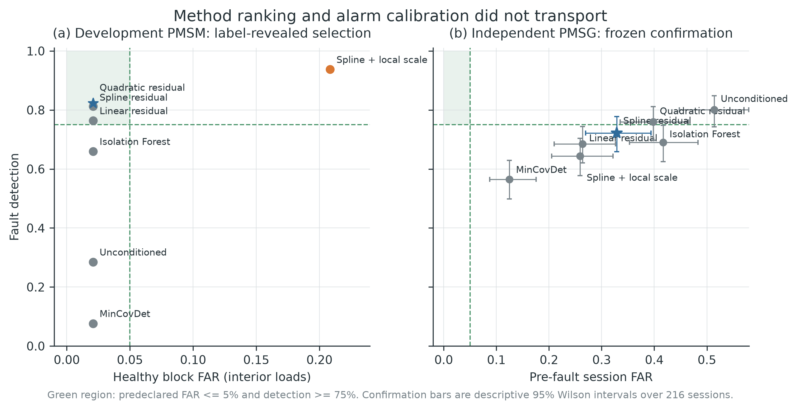
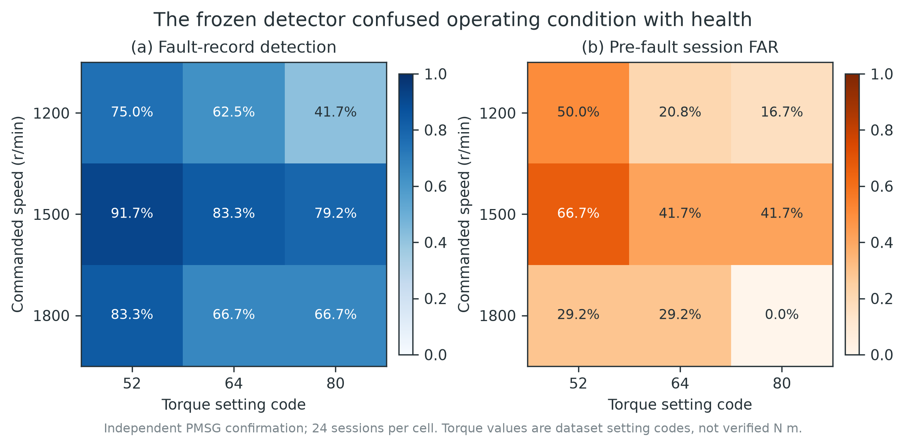
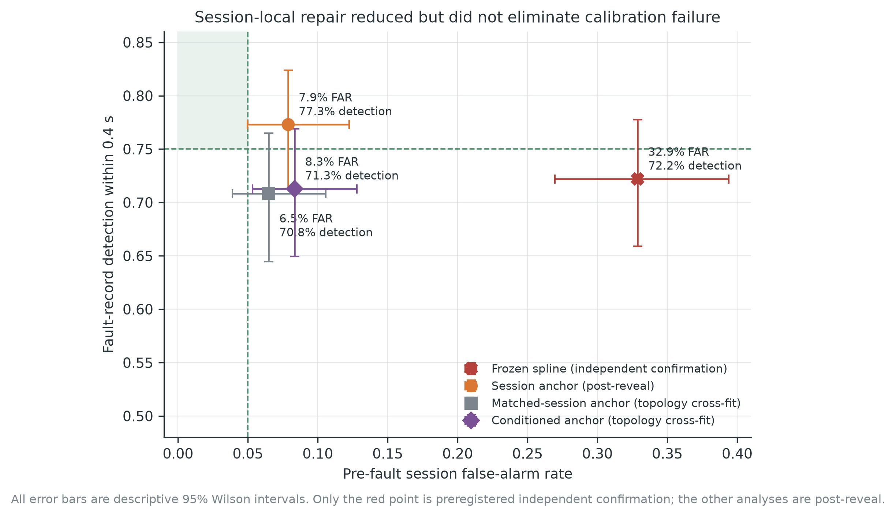
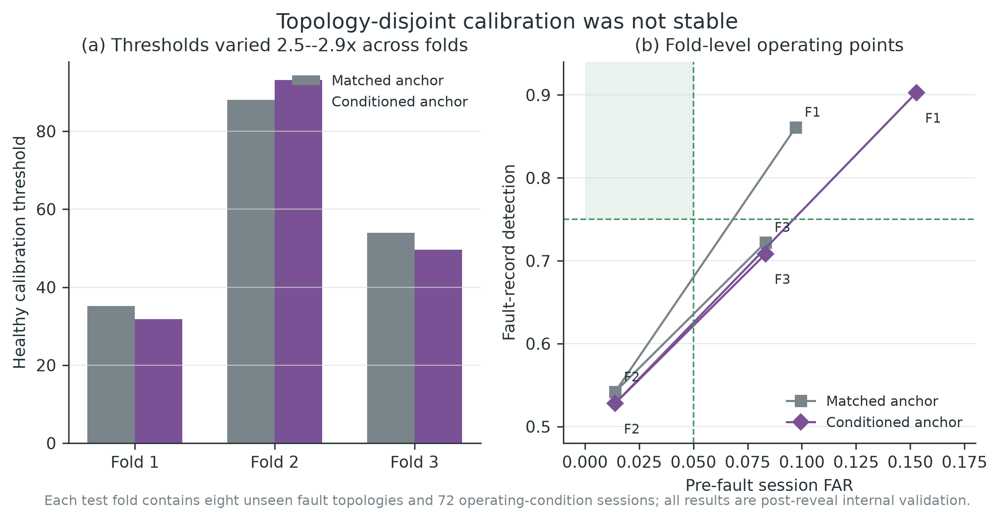
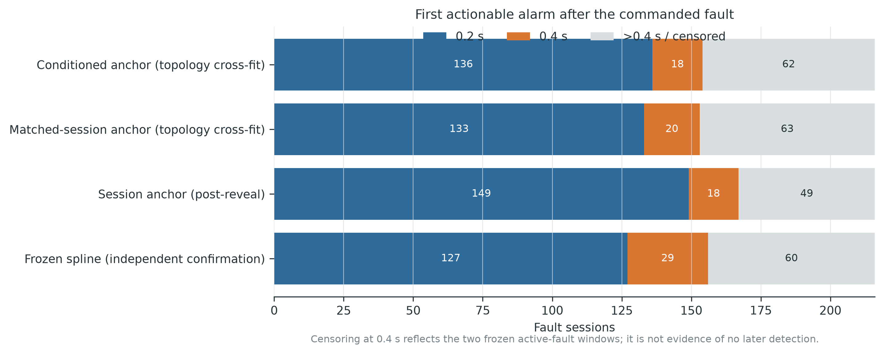

**Evidence status.** Development draft, 2026-08-21. The external PMSG signal protocol,
selected method, feature schema, healthy split, time windows, alarm level, and failure gates
were frozen before any PMSG signal array was deserialized or inspected. All session-anchor
analyses are explicitly post-reveal and cannot replace the failed independent confirmation.

# Abstract

Healthy-only fault detection is attractive when labeled machine faults are scarce, but a
low false-alarm rate on one test bench does not establish that its alarm calibration will
transport to another machine and laboratory. We selected a current-only detector on a
dual-three-phase permanent-magnet synchronous motor (PMSM), froze its algorithm and external
evaluation protocol, and then revealed an independently collected 2.5 kVA permanent-magnet
synchronous generator (PMSG) dataset. The detector uses 26 scale-free current features, a
whole-record cross-fitted spline model of healthy speed/load variation, shrinkage residual
covariance, a healthy-calibrated rank threshold, and operating-context abstention. On six
interpolation loads of the development PMSM, the selected method produced 1/48 actionable
healthy-block alarms (2.08%) and 82.29% record-macro fault-block detection. In the frozen PMSG
confirmation, however, it alarmed in 71/216 pre-fault sessions (32.87%; descriptive 95%
Wilson interval 26.95--39.39%) and detected 156/216 fault sessions within 0.4 s (72.22%;
65.90--77.77%). Both false-alarm gates and the point-detection gate failed. All six frozen
comparators also exceeded the 5% session false-alarm limit. A post-reveal two-window session
anchor reduced false alarms to 17/216 (7.87%) and detected 167/216 sessions (77.31%), but still
failed the false-alarm gate. Topology-disjoint cross-fitting gave 6.48--8.33% false alarms and
70.83--71.30% detection, while healthy calibration thresholds varied 2.5--2.9-fold between
folds. Thus, session offset explained part, but not all, of the external failure. The evidence
is conditional on one development motor and one confirmation generator and does not identify
which component of the compound shift caused failure. It does show that a healthy-only score,
an alpha-level rank threshold, and operating-point support are separate deployment objects;
all require prospective target-session validation.

**Keywords:** permanent-magnet synchronous machine; healthy-only fault detection; external
validation; false-alarm calibration; inter-turn short circuit; dataset shift

# 1. Introduction

Inter-turn short circuits disrupt the electrical symmetry of permanent-magnet synchronous
machines and can progress from a local winding defect to severe thermal and magnetic damage.
Three-phase stator current is an attractive monitoring signal because it is already measured
by most drives and carries negative-sequence, harmonic, and current-vector signatures of
electrical faults [@zafarani2018itscreview; @jeong2017negativesequence;
@li2024negativesequence]. The diagnostic problem is nevertheless difficult under changing
speed and load: the same operating variables that alter fault signatures also change healthy
current spectra and amplitudes [@urresty2013nonstationary; @zhou2023timevarying]. A detector
can therefore learn an operating condition rather than health.

Healthy-only learning offers a practical response to the shortage of representative fault
data. A normal-behavior model or one-class boundary is fitted without fault examples, and a
large deviation becomes an alarm [@yang2023selfsupervisedoneclass; @yoon2024deeponeclass].
Recent permanent-magnet monitoring work likewise uses normal current data to construct an
anomaly score before classifying fault type or severity [@wang2025pmsmhealth]. Healthy-only
fitting removes one unrealistic data requirement, but it does not remove the need to select
an operating threshold. That threshold depends on the score distribution of healthy data at
the deployed machine.

This distinction matters when a model leaves its development bench. Cross-domain and
cross-machine fault diagnosis are already established research areas
[@li2020domaingeneralization; @li2023causalconsistency; @zhao2024dgbenchmark;
@xiao2025dgsurvey]. Much of that literature evaluates fault-class accuracy, often with target
fault classes available during evaluation or adaptation. A deployed healthy-only alarm has a
different endpoint: it must maintain an acceptable false-alarm incidence before any target
fault is observed. A transfer method can rank faults above healthy samples and still be
unusable if the entire healthy score distribution moves beyond the old threshold.

Evaluation design compounds this problem. Adjacent windows from one recording are not
independent machine replicates. Randomly splitting such windows can leak run-, day-, or
specimen-specific information. In a bearing-diagnosis audit, physically separated split
strategies changed some reported accuracies by more than 40 percentage points
[@wheat2024dataleakage]. Structured cross-validation is consequently required whenever data
have temporal or hierarchical dependence [@roberts2017structuredcv]. For an external
deployment claim, an even stronger separation is needed: model and failure criteria should
be fixed before the external signal is inspected.

Rank-based conformal calibration offers an auditable way to map anomaly scores to p-values
under exchangeability [@angelopoulos2023conformal]. Conformal anomaly alarms have been used
in heterogeneous industrial fleets [@farouq2021mondrianfleet; @farouq2022conformalfleet], and
recent process-monitoring work compares their false alarms with classical thresholds
[@diallo2025falsealarms]. However, exchangeability does not follow from non-overlapping
windows, and distribution shift can invalidate the operating behavior of a frozen conformal
rule [@chernozhukov2018dependentconformal; @barber2026timeseriesconformal;
@lee2026conformalshiftfailure]. We therefore treat the rank threshold in this study as a
predeclared operational calibration rule and report empirical record/session false alarms;
we do not claim a distribution-free session-risk guarantee.

The present study asks a deliberately narrow question: does a healthy-only,
operating-conditioned detector selected on one PMSM retain its alarm operating point on an
independently collected permanent-magnet synchronous generator? The study contributes four
elements.

1. The development method is fitted and calibrated only on healthy records, with whole-record
   load folds and explicit abstention outside healthy operating support.
2. The selected method, feature schema, PMSG healthy split, time windows, alpha level, and
   pass/fail gates were hash-frozen before the first PMSG signal reveal.
3. The independent outcome is reported at the pre-fault session and fault-record level rather
   than treating hundreds of adjacent windows as physical replicates; all seven frozen
   methods remain visible.
4. After the confirmatory failure, session-local repair mechanisms are evaluated in a
   separately labeled, topology-disjoint internal analysis. Their results cannot replace the
   independent confirmation.

The headline result is negative but operationally useful. Development calibration did not
transport, and the remaining error was not removed by simply subtracting a short healthy
session anchor or reapplying the selected spline conditioning. This result changes the design
requirement for the next experiment: independent healthy sessions and prospective
target-session calibration are not optional implementation details; they are part of the
detector.

# 2. Related work and contribution boundary

## 2.1 Current-based short-circuit diagnosis under operating variation

Inter-turn fault diagnosis in PMSMs includes model-based observers, negative-sequence
indicators, spectral/order-tracking methods, and learned classifiers. Extended reviews and
experimental studies already establish the physical fault mechanisms and the dependence of
current signatures on winding configuration, speed, load, and control
[@zafarani2018itscreview; @urresty2013nonstationary]. Hybrid physical--data methods also
address sparse fault data and changing speed [@li2024physicaldatapmsm]. The present work does
not propose a new electrical signature. It intentionally uses a fixed set of scale-free
current features so that the evaluation focuses on healthy calibration and external
transport.

The development data are a published dual-three-phase PMSM experiment with controlled
inter-turn emulation [@kozovsky2022dualthreephasemodel; @kozovsky2024dualthreephasepmsm]. The
confirmation data are a separately published PMSG benchmark with controlled inter-turn and
inter-winding short circuits [@tominaga2025pmsgdataset]. These machines differ in role,
winding topology, instrumentation, acquisition rate, operating grid, and fault construction.
Their comparison is therefore an external compound-shift stress test, not a controlled causal
experiment that isolates one difference.

## 2.2 Healthy-only learning and cross-machine generalization

Healthy-only rotating-machine detection predates this work. One-class support estimation,
robust covariance, isolation methods, autoencoders, and self-supervised representations all
provide precedents [@scholkopf2001support; @liu2008isolationforest; @rousseeuw1999mcd;
@yang2023selfsupervisedoneclass; @yoon2024deeponeclass]. Similarly, supervised domain
generalization has been tested over multiple machines and operating conditions
[@li2023causalconsistency]. Our candidate spline residual, Isolation Forest, and Minimum
Covariance Determinant (MinCovDet) are thus comparators and engineering choices, not novelty
claims.

What remains less commonly reported is whether a preselected healthy-only *alarm operating
point* survives an external signal reveal. AUROC is threshold-free and can remain respectable
even when the deployed threshold produces unacceptable false alarms. Choosing a new threshold
after target faults are viewed confounds external evaluation with method development. Paper 3
therefore freezes the alpha-level calibration and evaluates a pre-fault session endpoint
before examining fault detection.

## 2.3 Conformal alarms under dependent and shifted observations

Given healthy calibration scores, an upper-tail rank p-value is transparent and
model-agnostic. Its ordinary finite-sample guarantee, however, requires exchangeability of
calibration and test scores. Neither multiple windows from one physical record nor sessions
collected at a different laboratory automatically meet that condition. Dependent conformal
inference and time-series analyses provide specialized theory, but do not justify labeling
arbitrary motor windows as independent [@chernozhukov2018dependentconformal;
@barber2026timeseriesconformal]. This paper accordingly uses conformal ranking for threshold
construction but labels all Wilson intervals and false-alarm estimates as descriptive for
the evaluated records. The contribution is the observed calibration-transport failure and
its documented chronology, not a new conformal guarantee.

# 3. Study chronology and datasets

## 3.1 Evidence statuses

Three evidence statuses were fixed. **Developmental** results may use development fault
labels to choose among seven candidates. **Confirmatory** results use the selected method and
PMSG protocol frozen before signal reveal; comparator outputs cannot replace the selected
method. **Post-reveal** analyses were specified only after the confirmatory result was known
and are used to investigate mechanisms. The complete chronology, protocol hashes, input
hashes, and an execution-incident disclosure are recorded in
`docs/paper3_reveal_log.md`.

Before the freeze, repository filenames and file metadata were enumerated. A Git size query
inadvertently fetched some objects containing MAT blobs into local object storage, but no MAT
signal variable was checked out for analysis, deserialized, plotted, summarized, or used for
a decision. We therefore use the precise phrase *signal-unrevealed metadata freeze*, not the
stronger claim that no signal bytes were ever transferred.

## 3.2 Development dual-three-phase PMSM

The development archive contains one dual-three-phase PMSM sampled at 10 kHz, with two
three-phase current subsystems. Eight healthy records cover commanded loads from 0 to 35 N m
in 5 N m steps; 48 fault records cover six shorted-turn/phase configurations at the same
loads. Each file contains a rising-speed experiment. A common preselected interval of
`[12,36)` s yields 120 non-overlapping 0.2 s windows and eight 3 s blocks per subsystem. Over
that interval, filename/command context spans 191.5--2708.3 r/min. Only the six phase currents,
time, commanded speed, and filename load are used. Measured speed, dq signals, voltage,
electrical angle, and fault-control variables are excluded.

Eight load folds hold out one complete healthy record and the six corresponding fault records
at a time. Each fold uses four other healthy loads for fitting and three for threshold
calibration. The six interior loads (5--30 N m) are the primary interpolation folds. The 0 and
35 N m folds deliberately lie outside the fit-axis bounds and serve as abstention stress
tests. The development feature table contains 56 physical records and 13,440
record--subsystem--window rows.

## 3.3 Independent PMSG confirmation

The external dataset was collected at a different laboratory from one 2.5 kVA, four-pole
PMSG [@tominaga2025pmsgdataset]. The frozen `v1.1.0` inventory contains 225 three-second MAT
files: nine standalone healthy files and 216 controlled fault files. The fault files comprise
108 inter-turn and 108 inter-winding records, formed by 24 terminal topologies at three
nominal speeds (1200, 1500, and 1800 r/min) and three torque setting codes (52, 64, and 80).
The codes are retained as dataset setting labels; they are not relabeled as N m. Signals were
sampled at 20 kHz.

The container audit required all 225 files, a common schema, and aligned finite vectors.
Exactly four variables were whitelisted: time and three phase currents (`t`, `Ia`, `Ib`,
`Ic`). Fault current, fault relay, angle, measured speed, voltage, torque, dq variables, and
all other fields were not loaded by the feature builder. All files passed without a
compatibility patch. The resulting table contains 2,493 0.2 s windows.

Standalone healthy files contribute `[0.2,2.8)` s (13 windows each). Four corner operating
settings form the healthy fit set (52 windows), the three middle-torque settings form the
calibration set (39 windows), and two 1500 r/min edge-torque files form the untouched healthy
test set (26 windows). Every fault record contributes three pre-fault windows from
`[0.2,0.8)`, two commanded-fault windows from `[1.0,1.4)`, and six recovery windows from
`[1.6,2.8)`. The first fault window includes possible relay delay by design.

| PMSG role | Physical files | Frozen interval per file | Feature windows | Permitted use |
|---|---:|---|---:|---|
| Healthy fit | 4 | `[0.2,2.8)` s | 52 | fit score geometry only |
| Healthy calibration | 3 | `[0.2,2.8)` s | 39 | set rank threshold only |
| Standalone healthy test | 2 | `[0.2,2.8)` s | 26 | external healthy diagnostic |
| Fault-record pre-period | 216 | `[0.2,0.8)` s | 648 | primary session FAR only |
| Commanded-fault period | 216 | `[1.0,1.4)` s | 432 | detection and alarm time |
| Recovery period | 216 | `[1.6,2.8)` s | 1,296 | secondary diagnostic only |

The following comparison makes the experimental unit explicit.

| Property | Development PMSM | Independent PMSG confirmation |
|---|---:|---:|
| Physical machines | 1 | 1 |
| Standalone healthy records | 8 | 9 |
| Fault records | 48 | 216 |
| Operating grid | 8 loads during a common speed rise | 3 speeds x 3 setting codes |
| Fault configurations | 6 | 24 terminal topologies in 2 families |
| Sampling rate | 10 kHz | 20 kHz |
| Basic feature window | 0.2 s | 0.2 s |
| Primary alarm unit | 3 s subsystem/system-max block | complete pre-fault or fault session |
| Healthy split | four load records fit, three calibrate, one test per fold | four records fit, three calibrate, two healthy-test |
| Population inference | one motor; blocks are dependent | one generator; 216 files are not machines |

# 4. Healthy-only detector and frozen evaluation

## 4.1 Current feature vector

Each 0.2 s three-phase window is mapped to 26 dimensionless features. They cover sequence
unbalance; coefficient of variation of fundamental amplitude, phase RMS, and Clarke-vector
radius; zero-sequence ratio; spectral entropy; lower and upper sideband ratios; mean and
maximum second-to-fifth harmonic ratios; aggregate harmonic distortion; and per-phase RMS
ratios, crest factors, and kurtosis. Absolute current scale and current-derived fundamental
frequency are excluded. Context is strictly exogenous: commanded/filename speed and
load/setting code.

Let `z` be the feature vector and `c` the two-dimensional operating context. A healthy mean
model `m(c)` is fitted with additive uniform-knot quadratic splines and ridge penalty one.
Predictions used to estimate residual geometry are obtained by four-fold cross-fitting with
complete healthy records held together. If `r = z - m(c)`, the componentwise residual median
is removed, robust scales are computed from median absolute deviations with standard-deviation
fallback, and a Ledoit--Wolf covariance estimate stabilizes the 26-dimensional geometry. The
anomaly score is the squared Mahalanobis distance of the standardized residual. Larger scores
are more anomalous.

The six comparators preserve the same information boundary: constant, linear, and quadratic
conditional residuals; the same spline with a context-local residual scale; Isolation Forest;
and MinCovDet. All fit only healthy features. Candidate order, hyperparameters, random seed,
and preprocessing were frozen in the development protocol.

## 4.2 Operating-context support and abstention

Fit context is robustly normalized. A nearest-fit radius is set to 1.1 times the largest
nearest-fit distance among disjoint healthy calibration rows, and a test point must also lie
inside every fit-context axis bound. A 3 s development block is supported only when all 15
windows of both subsystems are supported. Unsupported samples abstain; abstention is neither a
healthy decision nor a detected fault. The support rule is a geometric deployment warning,
not a conformal set. On the PMSG grid every evaluation context was supported, so external
abstention was zero and could not protect against outcome-distribution shift.

## 4.3 Rank threshold

For calibration scores `A_1,...,A_n` and a test score `A`, the upper-tail p-value is

`p(A) = [1 + sum_i 1(A_i >= A)] / (n + 1)`.

An actionable alarm requires `p <= 0.05` and supported context. In development, each method
uses 24 healthy 3 s calibration blocks; the block score is the maximum over 15 windows and
both current subsystems. In confirmation, `n=39` healthy calibration windows and the threshold
is the 38th order statistic because `ceil(40 x 0.95)=38`. These units are dependent within a
small number of physical records. The rank construction is therefore reproducible, but its
usual exchangeable finite-sample guarantee is not asserted.

## 4.4 Development selection

A method is development-eligible when its pooled actionable healthy-block FAR across the six
interpolation loads is no greater than 5% and fault abstention is no greater than 20%.
Among eligible candidates, the rule maximizes fault-record-macro actionable block detection,
then uses lower FAR, lower abstention, and frozen candidate order as tie breaks. Fault labels
select the method only at this stage. Edge-load results cannot select a method.

## 4.5 Confirmatory endpoints and gates

The selected spline residual is the sole confirmatory method. The six other candidates are
mechanically applied secondary comparators. The primary PMSG endpoints are:

1. pre-fault session FAR: any actionable alarm among three pre-fault windows;
2. fault-record detection: any actionable alarm among two active-fault windows;
3. command-to-alarm time: 0.2 s, 0.4 s, or right-censored beyond 0.4 s;
4. fault-record abstention.

The joint gate requires point FAR no greater than 5%, descriptive Wilson upper bound no
greater than 10%, point detection at least 75%, descriptive Wilson lower bound at least 65%,
and abstention no greater than 10%. All gates were written before signal reveal and none may
be relaxed after observing PMSG results.

# 5. Results

## 5.1 Development selection

The spline residual detector was the best eligible candidate on the six interpolation loads.
It produced 1/48 actionable healthy-block alarms (2.08%), no primary abstention, and 82.29%
record-macro actionable block detection across 36 fault records and 288 blocks. Every fault
record raised at least one alarm. The local-scale spline reached 93.75% detection but produced
10/48 healthy alarms (20.83%) and was ineligible. Both boundary loads were rejected by the
fit-axis support rule, as intended; their abstention is not evidence of fault detection.

Table 2 shows that method ranking did not transport. Development and confirmation endpoints
have different observation horizons, so absolute percentages should not be subtracted as a
single treatment effect; the relevant comparison is the within-dataset operating point and
the predeclared confirmation gate.

| Method | Development FAR (%) | Development detection (%) | Eligible/selected | PMSG pre-fault session FAR (%) | PMSG fault-record detection (%) |
|---|---:|---:|---|---:|---:|
| Unconditioned residual | 2.08 | 28.47 | yes | 51.39 | 80.09 |
| Linear residual | 2.08 | 76.39 | yes | 26.39 | 68.52 |
| Quadratic residual | 2.08 | 81.25 | yes | 39.81 | 75.93 |
| Spline residual | 2.08 | 82.29 | **selected** | 32.87 | 72.22 |
| Spline + local scale | 20.83 | 93.75 | no | 25.93 | 64.35 |
| Isolation Forest | 2.08 | 65.97 | yes | 41.67 | 68.98 |
| MinCovDet | 2.08 | 7.64 | yes | 12.50 | 56.48 |

## 5.2 Frozen independent confirmation failed

The selected spline threshold was 55.31. It alarmed in 10/26 untouched standalone healthy
windows and both healthy-test files. More importantly, 116/648 pre-fault windows alarmed,
placing at least one false alarm in 71/216 sessions. The pre-fault session FAR was therefore
32.87% (95% Wilson interval 26.95--39.39%), well above both predeclared FAR gates.

Among the 216 fault sessions, 156 raised an actionable alarm in the two-window active interval
(72.22%, 65.90--77.77%). The lower confidence limit exceeded 65%, but the point estimate did
not reach 75%. There was no PMSG abstention. The joint confirmation failed three of five
gates (Table 3). The selected method's record-level AUROC was 0.780 and AUPRC was 0.829,
illustrating why discrimination metrics alone cannot establish a usable alarm threshold.

| Confirmatory criterion | Observed | Required | Result |
|---|---:|---:|---|
| Pre-fault session FAR | 71/216 = 32.87% | <= 5% | fail |
| Descriptive FAR upper bound | 39.39% | <= 10% | fail |
| Fault-record detection | 156/216 = 72.22% | >= 75% | fail |
| Descriptive detection lower bound | 65.90% | >= 65% | pass |
| Fault-record abstention | 0/216 = 0% | <= 10% | pass |

No frozen comparator rescued the external conclusion. MinCovDet had the lowest pre-fault
session FAR, but 12.50% still exceeded the 5% point gate and its detection was only 56.48%.
The unconditioned residual detected 80.09% of faults but falsely alarmed in 51.39% of
pre-fault sessions. Because the selected method and confirmatory endpoint were fixed, neither
comparator can be promoted after reveal.

## 5.3 Operating-condition and fault-family heterogeneity

The frozen detector's errors varied systematically across the PMSG grid. Pre-fault session
FAR was 29.17%, 50.00%, and 19.44% at 1200, 1500, and 1800 r/min. Across torque setting codes
52, 64, and 80, it decreased from 48.61% to 30.56% and 19.44%, while detection also decreased
from 83.33% to 70.83% and 62.50%. The 1500/52 cell combined 91.67% detection with 66.67% FAR;
the 1800/80 cell combined 66.67% detection with 0% FAR. These patterns show that an apparently
strong cell can be achieved by moving the entire score distribution upward, not by separating
health from fault.

Inter-winding records were detected more often than inter-turn records (90.74% versus 53.70%)
but also had slightly higher pre-fault FAR (35.19% versus 30.56%). Terminal span, family, and
physical severity are not separable in this designed dataset, and the same operating cells
are reused across topologies. These strata are descriptive and cannot establish causal fault
effects.

Of the 156 detected sessions, 127 alarmed in the first 0.2 s window and 29 only in the second;
60 were right-censored beyond 0.4 s. Right-censoring means that the fixed active-fault horizon
ended, not that a later detector could never alarm.

# 6. Post-reveal mechanism analyses

The analyses in this section were conceived after the failed confirmation was visible. They
remain useful for mechanism assessment, but they are not independent validation and cannot
change the confirmatory verdict.

## 6.1 Two-window session anchor

Each PMSG record begins with a healthy interval. The first two 0.2 s windows were therefore
used to form a coordinatewise median anchor, and every later feature vector was replaced by
its within-session difference from that anchor. A shrinkage Mahalanobis geometry was fit to
44 residual windows from the four standalone healthy fit files; 33 residual windows from the
three calibration files set the alpha-level threshold. This preserves the original 4/3/2
healthy file split.

The session anchor lowered pre-fault session FAR from 32.87% to 7.87% (17/216; 95% Wilson
4.97--12.24%) and increased detection to 77.31% (167/216; 71.28--82.39%). It therefore
demonstrated that session offset was material. It did not pass the original FAR gates: the
point FAR exceeded 5% and its upper bound exceeded 10%. Moreover, the untouched standalone
healthy-test residuals produced 10/22 window alarms, showing that the standalone calibration
files themselves did not define a stable residual threshold.

## 6.2 Topology-disjoint matched-session calibration

The remaining calibration-source mismatch was tested using only the healthy pre-fault portion
of fault sessions. Twenty-four fault topologies (12 per family) were sorted within family and
assigned modulo three to balanced buckets. In each of three outer folds, eight topologies
(72 operating-condition records) fit residual geometry, eight calibrated the threshold, and
eight formed the test set. Only pre-fault residuals entered fitting and calibration; the two
active windows were revealed for the test bucket. Every topology was tested once.

Matched-session cross-fitting produced 14/216 pre-fault false alarms (6.48%, 3.90--10.58%) and
detected 153/216 faults (70.83%, 64.45--76.49%). Neither point endpoint met its original gate.
Fold results exposed substantial instability: healthy thresholds were 35.15, 88.08, and
53.93; FARs were 9.72%, 1.39%, and 8.33%; and detection was 86.11%, 54.17%, and 72.22%.

## 6.3 Conditioned session anchor

As the final allowed PMSG mechanism check, the already selected spline model was applied to
the session residuals using the same topology buckets, ridge, knots, alpha, and support rule.
No additional feature or detector was searched. The conditioned anchor produced 18/216 false
alarms (8.33%, 5.34--12.79%) and 154/216 detections (71.30%, 64.93--76.92%). Thresholds were
31.80, 93.13, and 49.56, again varying by almost threefold. The original joint gate failed.

Across the four PMSG analyses, the number detected in the first fault window ranged from 127
to 149 and the number censored beyond 0.4 s ranged from 49 to 63. The repair mechanisms mainly
moved the healthy threshold and first-window sensitivity; none simultaneously stabilized FAR
and detection.

| PMSG analysis | Evidence status | Calibration source | Pre-fault FAR | Detection <=0.4 s | First-window / censored |
|---|---|---|---:|---:|---:|
| Frozen spline | independent confirmation | 3 standalone healthy files | 71/216 (32.87%) | 156/216 (72.22%) | 127 / 60 |
| Session anchor | post-reveal exploratory | 3 standalone healthy files | 17/216 (7.87%) | 167/216 (77.31%) | 149 / 49 |
| Matched anchor | post-reveal topology cross-fit | healthy pre-periods from disjoint topology bucket | 14/216 (6.48%) | 153/216 (70.83%) | 133 / 63 |
| Conditioned anchor | final post-reveal topology cross-fit | same matched-session design | 18/216 (8.33%) | 154/216 (71.30%) | 136 / 62 |

# 7. Discussion

## 7.1 The calibration set is part of the deployed detector

The central finding is not simply that accuracy decreased. The healthy score distribution
and its threshold did not transport. On development interpolation loads, five of seven
candidates shared an actionable FAR of 2.08% because the rank threshold and support rule were
effective within that bench. On the PMSG, every candidate exceeded the 5% session FAR gate,
despite being refit and recalibrated from PMSG standalone healthy files. The problem was
therefore not only zero-shot parameter transfer. Three healthy calibration records did not
represent the pre-fault distribution of the 216 fault experiments.

This distinction changes how a healthy-only detector should be specified. The deployed object
is not just a feature extractor and anomaly score. It includes the source of healthy
calibration sessions, their acquisition timing, the aggregation horizon, the support rule,
and the threshold-update policy. Reporting only AUROC or fault-record-any detection leaves
these components untested.

## 7.2 Operating-context support cannot detect every domain shift

The support rule correctly abstained on development loads outside the fit range. It abstained
on no PMSG record because all nominal speed/setting combinations lay inside the healthy
context box. Nevertheless, external false alarms were high. This is an important negative
result: exogenous context support detects geometric extrapolation in `c`, not a change in the
conditional distribution `P(z|c)` caused by another winding topology, sensor chain,
controller, laboratory, or session procedure. A deployment warning therefore needs both
context support and direct monitoring of healthy residual transport.

The PMSG heatmap further shows why conditioning alone is insufficient. High detection and
high false alarms co-occurred at several settings. A regression can remove the mean trend
with nominal speed and setting code while leaving condition-dependent covariance or
session-specific offsets. The final conditioned-anchor analysis retained almost threefold
threshold variation, consistent with residual calibration instability rather than a missing
single mean curve.

## 7.3 Session anchoring helped, but was not independently confirmed

Subtracting two initial healthy windows reduced false alarms by 25 percentage points relative
to the frozen spline and produced the highest detection among the four PMSG analyses. This is
engineering evidence that a short commissioning prefix can remove acquisition/session
offset. It is not permission to deploy the anchor. The method was proposed after PMSG faults
and per-condition results were visible, its standalone healthy-test FAR remained high, and
its topology-disjoint internal validation did not pass the original gate. A genuinely new
machine with a prospectively frozen anchor protocol is needed.

## 7.4 Why the negative result is useful

Negative external validation can prevent a more consequential failure: interpreting a
within-bench alarm rate as a field guarantee. The current experiment provides a complete
record of what was fixed, what failed, and what was tried afterward. It also shows that a
stronger detector score need not yield a better alarm. The unconditioned residual had the
highest frozen PMSG detection but the worst false-alarm incidence; MinCovDet had the lowest
false alarms but inadequate detection. Model ranking depends on the operational loss, not
only discrimination.

The next study should collect multiple independent healthy sessions per operating cell and
date, reserve entire sessions for prospective calibration, and hold out a physical machine or
laboratory for the final reveal. Alarm burden should be reported per session and per operating
hour. A sequential rule should distinguish a transient isolated score from persistent
evidence, and its reset/update policy must be frozen. If a session anchor is used, anchor
duration, contamination checks, and fallback abstention must be specified before faults are
observed.

# 8. Limitations

First, the study contains two physical machines: one development motor and one confirmation
generator. The 216 PMSG fault files are not independent machines, and their speed/setting and
topology repetitions do not support a fleet-population confidence interval. Wilson intervals
describe the observed session proportions only.

Second, external shift is compound. Motor versus generator operation, single versus dual
three-phase winding, sensors, sampling rates, controller dynamics, laboratory procedure, and
fault construction change together. The study establishes conditional failure for this
transport path but cannot assign causal responsibility to one factor.

Third, controlled short circuits may not reproduce gradual insulation degradation, thermal
propagation, or field noise. The fixed active interval is only 0.4 s, so undetected records are
right-censored rather than proven permanently undetectable. No vibration, voltage,
temperature, or flux measurement was used.

Fourth, windows within records and records collected from one machine are dependent. The
alpha-level rank rule is operational, not a formal guarantee of 5% session FAR under this
dependence. The small number of standalone healthy PMSG files limits calibration resolution
and representativeness.

Fifth, development amendments to load roles and support geometry were made after developmental
fault outputs were visible, before the PMSG signal reveal. They are documented and allowed
only for development. All session-anchor methods were conceived after confirmation and remain
post-reveal. There is no untouched validation target for those repairs.

# 9. Conclusion

A healthy-only, speed/load-conditioned current detector that appeared operationally acceptable
on a development PMSM did not retain its alarm calibration on an independent PMSG bench. The
frozen detector falsely alarmed in 32.87% of pre-fault sessions and detected 72.22% of fault
records within 0.4 s, failing its predeclared joint gate. Every frozen comparator also exceeded
the 5% false-alarm limit. Session anchoring reduced false alarms substantially, but
topology-disjoint analyses retained 6.48--8.33% FAR, 70.83--71.30% detection, and large
fold-to-fold threshold variation.

The practical conclusion is direct: within-bench healthy calibration, nominal operating-point
support, and a conformal-style rank threshold do not by themselves authorize cross-machine
deployment. A prospective target-session calibration design, repeated independent healthy
sessions, and an untouched machine/laboratory reveal are required. Until such evidence exists,
the correct output is an abstention or a commissioning study, not a claimed low-risk alarm.

# Data and code availability

The development archive is available under DOI `10.5281/zenodo.13889418`. The independent
PMSG data article and versioned archive are available under DOIs
`10.1016/j.dib.2025.112040` and `10.5281/zenodo.15741561`. Analysis code, protocol files,
file hashes, processed-feature builders, frozen summaries, figures, and a reproducibility
bundle will be deposited in a public repository upon acceptance. The raw third-party data are
not redistributed in the manuscript bundle; download instructions and immutable source
identifiers are included.

# Declarations

**Funding:** Author input required.

**Competing interests:** The authors declare no competing interests, subject to author
confirmation.

**Author contributions:** Author input required.

**Ethics approval:** Not applicable; the study uses public machine-test datasets and no human
or animal participants.

**Use of generative AI:** The authors must complete this statement according to the selected
journal's policy and disclose any language or coding assistance as required.
