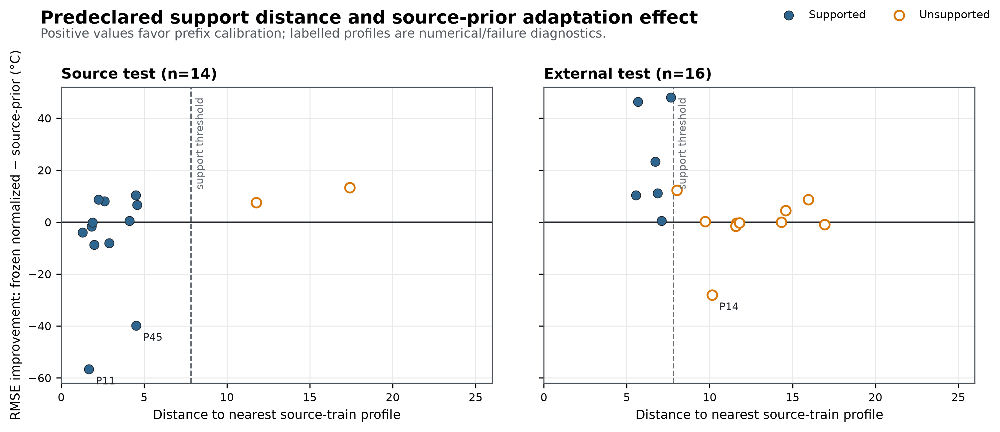
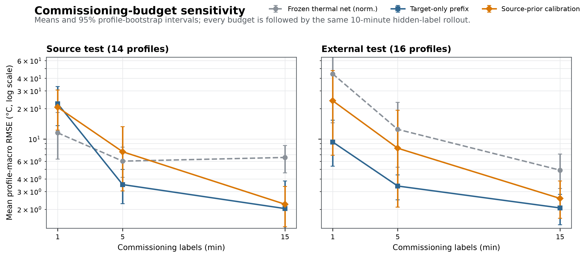
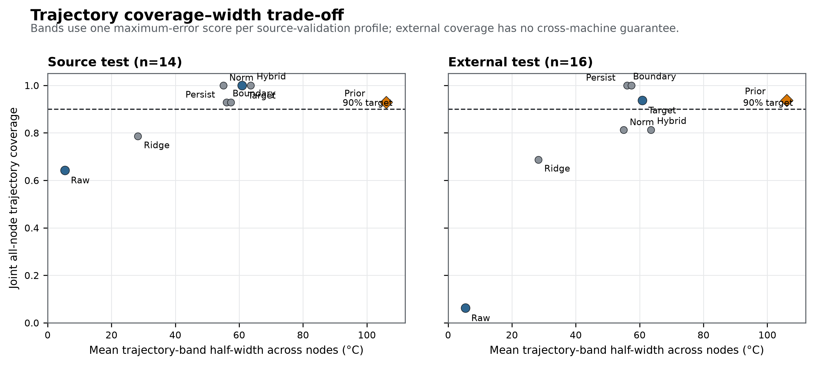
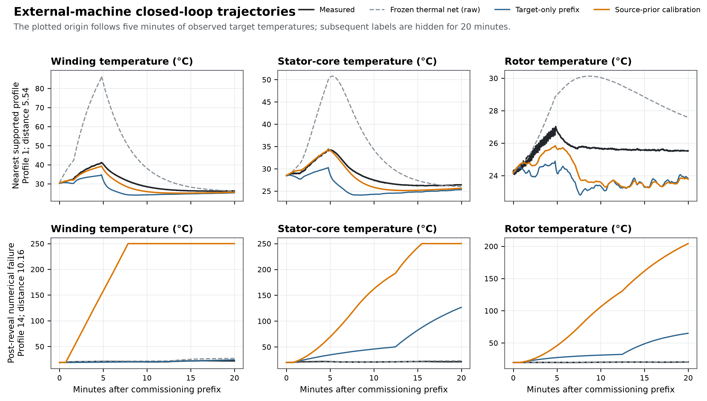

**Evidence status.** Complete development manuscript, 2026-08-21. The data contract, complete-profile
splits, methods, hyperparameter grids, commissioning budgets, rollout horizons, support rule,
trajectory-band construction, endpoints, and pass/fail gates were frozen before source-test or
external-machine prediction errors were computed. Post-reveal analyses are labelled as diagnostics
and do not replace the all-profile primary results.

# Abstract

Thermal models of permanent-magnet synchronous motors (PMSMs) are commonly validated on held-out
operating profiles from the same physical machine. Whether their dynamics, source priors, and
uncertainty estimates transport to a second machine is less often tested under a target-label budget
fixed before external outcomes are known. We harmonized two public PMSM datasets into winding,
stator-core, and rotor temperature states and froze a complete-profile benchmark before evaluating
the locked test sets. The source comprised 69 profiles from one 52 kW PMSM; the external set
comprised 16 profiles from a second interior PMSM. Eight target-blind or five-minute commissioning
methods were compared through 20-minute recursive rollouts. A nonnegative raw-unit thermal network
achieved 1.87 °C profile-macro RMSE on 14 source-test profiles but 24.49 °C externally, a 13.12-fold
degradation; its source-calibrated joint trajectory band covered only 1/16 external profiles.
Source-prior prefix calibration reduced external RMSE relative to the frozen normalized source
network (21.98 to 13.61 °C; paired improvement interval lower bound 0.13 °C), yet failed the source
adaptation gate, was worse overall than target-only five-minute fitting (6.02 °C) and boundary
persistence (6.17 °C), and activated the numerical temperature guard 999 times on one external
profile. A predeclared exogenous-support rule accepted 6/16 external profiles. Within that secondary
subset, source-prior calibration achieved 3.19 °C versus 4.57 °C for target-only fitting, but its
62.5% abstention rate prevents a broad deployment claim. Source-prior bands reached 15/16 external
joint coverage only with a mean half-width of 106.07 °C. With 15 minutes of target labels, target-only
fitting reached 2.07 °C external RMSE on a common 10-minute horizon without guard activation. These
results show that within-machine accuracy, cross-machine transport, numerical reliability, support,
and useful uncertainty are distinct requirements. For the two machines studied, target-only
commissioning was safer than assuming that a source electrothermal prior would help everywhere.

**Keywords:** permanent-magnet synchronous motor; temperature estimation; electrothermal model;
negative transfer; digital twin commissioning; uncertainty quantification; dataset shift

# 1. Introduction

Permanent-magnet synchronous motors combine high power density and efficiency with thermal limits
that are difficult to observe directly. Winding temperature affects insulation life, stator-core
temperature reflects distributed losses and cooling, and rotor or magnet temperature affects both
demagnetization risk and torque production. Embedded sensors are costly or unavailable at critical
rotating locations, so real-time estimators are used to reconstruct internal temperatures from
electrical, mechanical, coolant, and ambient measurements.

The literature spans lumped-parameter thermal networks (LPTNs), black-box regressors, recurrent
networks, and hybrid physics--learning models. Deep residual estimation demonstrated the value of
data-driven temporal structure [@kirchgassner2021deepresidual], while thermal neural networks made
the LPTN state-space structure trainable from data [@kirchgassner2022tnn]. Later work incorporated
LPTN priors into recurrent networks for multinode estimation [@liu2024lptninformed], combined
multiphysics priors with operator learning [@son2025mpidon], and explored dynamic topology and
hot-spot forecasting [@zhu2026hotspotforecasting]. These methods make within-system temperature
estimation increasingly accurate.

Deployment, however, introduces a different question. A source model can be accurate on new duty
cycles of the motor that generated its training data while failing on a second motor with different
power, cooling, sensor locations, controller scaling, and excitation. Transferable networks,
incremental learning, and adaptive digital twins have begun to address this problem
[@zhang2024transferabletemperature; @shafieeroudbari2024incremental;
@gao2026adaptivedigitaltwin]. Yet a favorable result can depend strongly on how target labels are
allocated, whether adjacent time samples leak across splits, and whether unsupported target
conditions or numerically unstable trajectories are silently removed. Negative transfer is not a
rare theoretical corner case: source information can increase target risk when the source--target
relationship is misspecified [@wang2019negativetransfer; @kumar2024negativetransfer].

Thermal time series amplify these evaluation risks. Thousands of seconds from one drive profile are
dependent observations, not thousands of independent machines. Random sample splits can reward
interpolation within a trajectory instead of generalization to a new operating profile. Hierarchy-
and time-aware validation is therefore required [@hurlbert1984pseudoreplication;
@roberts2017structuredcv]. Closed-loop evaluation is also essential: using the measured temperature
at every prediction step evaluates one-step correction, whereas an online thermal state estimator
must survive error accumulation once target labels disappear.

Uncertainty and deployment support create two additional layers. Split conformal methods can turn
complete-profile maximum errors into trajectory bands under an exchangeability assumption
[@lei2018distributionfree; @diquigiovanni2022multifunctional]. That assumption is plausible only
within a carefully defined population and does not automatically survive a physical-machine shift;
covariate-shift conformal methods require additional structure or weighting information
[@tibshirani2019covariateshift]. Furthermore, coverage alone is inadequate: a band can cover nearly
everything by becoming too wide to support a thermal limit decision. Likewise, rejecting an
unsupported profile may prevent a dangerous prediction but can leave most intended deployments
unserved.

This study asks: **Do a low-order electrothermal model, a five-minute source-prior calibration, and
source-calibrated trajectory uncertainty transport from one recorded PMSM to a second?** The aim is
not a new neural architecture. It is an auditable transport benchmark with a deliberately frozen
decision structure. Four contributions follow.

1. Two public, physically distinct PMSMs are harmonized into a documented three-node contract while
   preserving semantic differences and blocking published target-model estimates from the primary
   pipeline.
2. Eight methods are compared under identical complete-profile splits and recursive rollouts,
   including raw and normalized source thermal networks, target-only prefix fitting, source-prior
   prefix calibration, persistence controls, linear ARX, and a nonlinear residual comparator.
3. Model selection, five-minute target-label access, support, uncertainty, numerical guards, and
   pass/fail gates are fixed before the 14 source-test and 16 external profiles are revealed.
4. Negative results remain primary: direct transfer, adaptation, uncertainty width, and abstention
   are reported together so that a conditional success cannot conceal an all-profile failure.

The main finding is asymmetric. The source model is excellent within its own machine but transports
poorly. A source prior can help in a narrow, predeclared external support region, yet target-only
commissioning is more reliable overall. This shifts the engineering question from “Which source
architecture has the lowest held-out error?” to “When should a deployed estimator trust, adapt, or
abstain from its source prior?”

# 2. Related work and contribution boundary

## 2.1 Physics-guided motor-temperature estimation

Classical LPTNs express heat storage and transfer through coupled first-order states. They are
compact and interpretable but require topology and parameter choices that may not be identifiable
from limited drive data. Purely learned estimators avoid explicit thermal circuits but can exploit
spurious operating correlations. Physics-guided models occupy the middle ground: they retain
state-space evolution or sign constraints while learning effective couplings and loss mappings.
Thermal neural networks are a prominent example [@kirchgassner2022tnn], and LPTN-informed recurrent
learning extends this idea to multinode estimation [@liu2024lptninformed].

The present positive thermal network belongs to this broad grey-box family. Its coefficients are
effective, nonnegative heat-transfer and heat-source terms. They are not claimed to be unique
physical resistances or capacitances. The paper therefore does not claim architectural novelty,
first use of physics guidance, or state-of-the-art within-machine RMSE. The benchmark instead uses a
transparent low-order model because its source parameters can be explicitly retained, discarded,
or regularized during target commissioning.

## 2.2 Transfer, adaptation, and digital-twin commissioning

Transferable permanent-magnet temperature estimation has been studied with data augmentation and
domain adaptation [@zhang2024transferabletemperature]. Incremental deep learning updates a rotor
temperature estimator during operation [@shafieeroudbari2024incremental], while recent adaptive
digital-twin work combines Bayesian self-calibration and hierarchical physics-aware learning
[@gao2026adaptivedigitaltwin]. These studies establish that cross-domain adaptation is an active
area; they also make a “first adaptive estimator” claim untenable here.

Our narrower gap concerns protocol and decision accounting. We distinguish four deployment objects:
the frozen source dynamics, the target prefix used for commissioning, the exogenous support region,
and trajectory uncertainty. We compare source-prior and target-only fitting with the same model
class and labels. This isolates whether source information helps beyond the target prefix rather
than conflating transfer with a change in architecture. Every external profile remains in the
primary endpoint, including unsupported profiles and guarded rollouts.

## 2.3 Complete-profile evaluation and trajectory uncertainty

The experimental unit is a complete operating profile. This choice follows general warnings about
pseudoreplication [@hurlbert1984pseudoreplication] and structured cross-validation
[@roberts2017structuredcv]. Profile-macro error gives each duty cycle equal weight regardless of
duration. Paired bootstrap intervals resample complete profiles, preserving within-profile temporal
dependence. Because each dataset contains only one physical motor, these intervals quantify
condition-to-condition variability for the recorded machines; they are not fleet-population
intervals.

For uncertainty, a single maximum absolute error per validation profile and node calibrates a
constant-width band over the entire recursive trajectory. This construction is related to
functional conformal bands [@diquigiovanni2022multifunctional;
@diquigiovanni2025importance] and engineering surrogate uncertainty
[@elmekkaoui2023pipeline; @jaber2025gpsurrogate; @gray2025functional;
@gopakumar2026surrogate]. With 11 calibration profiles and nominal coverage 0.90, the required
finite-sample rank is 11, so the band uses the maximum validation-profile score. The ordinary
within-machine interpretation still depends on profile exchangeability. External application is a
stress test, not a distribution-free cross-machine guarantee.

# 3. Materials and methods

## 3.1 Datasets, audits, and analysis units

The source dataset is the public Electric Motor Temperature dataset
[@kirchgassner2021motortemperaturedata], used in the thermal-neural-network study
[@kirchgassner2022tnn]. It contains 1,330,816 rows from 69 operating profiles of one 52 kW PMSM,
sampled at 2 Hz for 184.836 h. The raw file SHA-256 is
`78f3d150f0f2ad9c5dc7ff24dd12c00d386ad530f48c1589ad24fcd88867d3ad`.

The external dataset accompanies the LPTN-informed LSTM study [@liu2024lptninformed]. Sixteen raw
profile files contain 97,725 rows from a second interior PMSM at the published one-second update
step. The frozen repository commit is `98e4566b5fb7c70499996fda18dd73179ec16509`. The files imply
27.146 h at 1 Hz, although the repository README states 23.8 h; both values are disclosed and all
calculations use the auditable row count and code-defined step. The aggregate file contains three
published target-specific estimates. `active_wind_est`, `stator_est`, and `rotor_est` were blocked
from preprocessing, model fitting, tuning, support scoring, and primary evaluation. They were used
only after the frozen run as a clearly labelled contextual oracle.

All required variables were finite, exact duplicate rows were absent, and every profile occupied a
single contiguous block. Source profiles ranged from 18.13 to 366.43 min; external profiles ranged
from 25.60 to 220.60 min. Thus, every locked profile supported a five-minute prefix followed by the
common 20-minute primary rollout. One complete profile is the statistical unit. No inference treats
seconds as independent replicates.

## 3.2 Three-node semantic bridge and resampling

Table 1 defines the harmonized state. Winding is direct in the source and the mean of two active-
winding sensors externally. Stator core is the mean of tooth and yoke temperatures in the source
and of slot-bottom and outer-yoke temperatures externally. The source permanent-magnet temperature
is mapped to the external rotor measurement. The latter is a semantic proxy, not an assertion of
identical sensor placement.

**Table 1. Harmonized variables and non-equivalence boundaries.**

| Quantity | 52 kW source PMSM | External IPMSM | Treatment |
|---|---|---|---|
| Winding state | `stator_winding` | mean(`activewind_1`, `activewind_2`) | Common winding node |
| Stator-core state | mean(`stator_tooth`, `stator_yoke`) | mean(`slotbottom`, `outer_yoke`) | Constructed core mean |
| Rotor state | `pm` | `rotor` | Semantic transport proxy |
| Boundaries | `ambient`, `coolant` | `ambient`, `water_outlet` | Temperatures in °C |
| Electrical inputs | `u_d`, `u_q`, `i_d`, `i_q` | `Ud`, `Uq`, `IdFbk`, `IqFbk` | dq channels in published units |
| Mechanical inputs | `motor_speed`, `torque` | `speed`, `Torque` | rpm and N m per source documentation |

The source was reduced deterministically to 1 Hz in non-overlapping two-row bins. Exogenous and
boundary variables were averaged, while the thermal state used the bin endpoint. An odd terminal
bin was retained. External data remained at native 1 Hz. No interpolation or imputation was used.

## 3.3 Frozen source split and deployment timeline

A grouped split with seed 42 assigned 44 source profiles to training, 11 to validation, and 14 to a
locked source test. The exact IDs are stored in the machine-readable configuration. No profile
crossed roles, and all 16 external profiles were forbidden during model or hyperparameter
selection.

For the primary deployment simulation, temperatures were observed for the first 300 s. All methods
started the rollout from the state at second 299. A frozen method could use this boundary state but
could not update parameters from prefix labels. Target-only and source-prior models could fit only
the 299 one-second transitions inside the prefix. Temperatures from `[300,1500)` s were then hidden
until the full 1,200-s recursive trajectory was generated. The source test additionally used
`[300,3600)` s as a 55-min long-horizon endpoint. Numerical states were clipped to
[-50,250] °C for all methods, and every clip or non-finite state was counted. Any guard activation
was treated as a reliability failure even when clipping kept the reported error finite.

Sensitivity analyses used 60-, 300-, and 900-s commissioning prefixes, each followed by the same
600-s hidden-label rollout. This makes the budget comparison a fixed-horizon analysis; it does not
replace the primary 300-s/1,200-s endpoint.

## 3.4 Electrothermal state model

Let T(j,t) denote one of three temperatures at second t. For node j, the model predicts

**ΔT(j,t) = Σ(k≠j) a(j,k)[T(k,t−1)−T(j,t−1)] + b(j,c)[Tc(t)−T(j,t−1)] + b(j,a)[Ta(t)−T(j,t−1)] + Σ(m=1…5) q(j,m) φm(t).**

All a(j,k), b(j,c), b(j,a), and q(j,m) are constrained nonnegative. The five loss proxies
are squared current magnitude, squared current times absolute speed, voltage magnitude times
current magnitude, absolute mechanical-power proxy, and squared speed. This sign-constrained
parameterization encodes effective heat exchange and nonnegative generation while remaining linear
in coefficients.

Two source representations were frozen. The raw-unit network divided each loss proxy by a numerical
scale learned only from source-train profiles; it preserved absolute machine magnitude. The
normalized network divided current, voltage, speed, and torque by each deployment profile's
first-five-minute 95th percentile, subject to positive floors learned from source prefixes, before
forming the proxies. It therefore attempted capacity-insensitive scaling without using target
temperatures. Source fitting used at most the first 60 min of each training profile and assigned
equal total regression weight to every physical profile.

## 3.5 Locked methods and target commissioning

Eight methods were fixed before test reveal:

1. **Initial-state persistence:** all temperatures remain at their prefix-boundary values.
2. **Boundary-shift persistence:** the initial state follows the change in the mean ambient/coolant
   boundary.
3. **Source Ridge ARX:** unconstrained linear one-second increments with an intercept.
4. **Raw source thermal network:** the nonnegative model with source-unit loss scales.
5. **Normalized source thermal network:** the same model with prefix-derived magnitude scales.
6. **Target-only prefix network:** a new nonnegative model fitted only to the target prefix.
7. **Source-prior prefix network:** the target-prefix objective plus a quadratic penalty toward the
   normalized source parameters.
8. **Source thermal plus residual:** the normalized source network with fixed histogram-gradient
   boosters fitted to source transition residuals.

For target-only fitting, the source penalty was zero. For source-prior calibration, the objective
for each node was the mean prefix squared transition error plus λ ||θ − θsource||², subject to
nonnegative coefficients. Ridge alpha was selected from {0.01, 0.1, 1, 10, 100}; λ was selected from
{0.1, 1, 10, 100, 1000}. Only the 11 source-validation profiles were used, selecting alpha 100 and
λ = 0.1. Positive models used bounded least squares with tolerance 10⁻¹⁰ and no intercept. The
residual comparator used
three histogram-gradient regressors with learning rate 0.05, 200 iterations, 15 leaves, minimum
leaf size 50, L2 penalty 1.0, and seed 20260821.

The external authors' published LPTN estimates were evaluated only as target-specific context. They
had access to target-machine development information unavailable to the target-blind methods and
are not treated as a fair competing baseline.

## 3.6 Support rule

Support used no target temperature labels. For each profile, median and 95th-percentile summaries of
current magnitude, voltage magnitude, absolute speed, absolute torque, electrical- and mechanical-
power proxies, coolant, and ambient were computed over the first 300 s. Features were robust-scaled
by source-train medians and median absolute deviations. The score was distance to the nearest
source-train profile. The rejection threshold was the 95th percentile of source-train leave-one-
profile-out nearest-neighbour distances, fixed at 7.8263. Unsupported profiles remained in all
primary error, interval, and numerical-failure results. The accepted subset is explicitly
secondary.

## 3.7 Trajectory bands

For every method and node, each source-validation profile supplied one score: maximum absolute
closed-loop error over the declared horizon. A constant half-width was set to the
ceil[(n+1)(1−α)] order statistic for n = 11 and 1−α = 0.90. The rank is 11, so
the maximum validation score defines the band. We report node-wise simultaneous-in-time coverage,
joint all-node coverage, and half-width. External coverage is descriptive because physical-machine
shift violates the basis for an ordinary exchangeable-profile guarantee.

## 3.8 Endpoints, bootstrap, and predeclared gates

RMSE and MAE were calculated separately for each node within each complete profile. Profile-macro
RMSE is the arithmetic mean of the three node RMSEs, followed by an equal-weight mean over profiles.
We also report medians, 90th percentiles, worst-profile error, maximum absolute error, guard counts,
and per-profile results.

Paired method differences used 10,000 bootstrap resamples of complete profiles with seed 20260821.
Intervals describe the recorded profile population, not unseen motors. Holm adjustment was applied
within declared comparison families.

Three gates were frozen. Source and external adaptation each required at least 10% RMSE reduction
versus the normalized source network and a positive lower bound for the paired improvement
interval. Source uncertainty required at least 0.80 node-wise trajectory coverage for every node.
Passing one gate did not override failure of another, a numerical guard event, or poor comparison
with simpler controls.

# 4. Results

## 4.1 Within-machine accuracy did not predict transport

On the 14 source-test profiles, the raw source thermal network was clearly strongest at the primary
20-min horizon: 1.8673 °C profile-macro RMSE, median 1.7860 °C, and worst-profile RMSE 4.0679 °C
(Table 2; Figure 1). Its source 55-min RMSE remained 2.3761 °C. These values show that the low-order
state model captured the source machine's recorded dynamics and was not merely a weak model that
failed everywhere.

The same frozen model produced 24.4928 °C external RMSE, median 27.2797 °C, and worst-profile RMSE
44.3206 °C. The external/source mean ratio was 13.1167. Winding error was particularly large
(43.3457 °C), compared with 20.2454 °C for stator core and 9.8874 °C for the rotor proxy. Absolute-
unit source parameters therefore did not survive the compound shift in machine scale, thermal
topology, cooling, sensors, controls, and excitation.

**Table 2. Frozen matched-horizon profile-macro performance. Lower is better. The target-specific
LPTN is external context, not a target-blind comparator.**

| Method | Source RMSE (°C), n=14 | External RMSE (°C), n=16 | External median (°C) | External worst (°C) | External clips |
|---|---:|---:|---:|---:|---:|
| Raw source thermal network | **1.867** | 24.493 | 27.280 | 44.321 | 0 |
| Normalized source thermal network | 8.918 | 21.984 | 9.786 | 122.962 | 683 |
| Source Ridge ARX | 9.570 | 16.760 | 8.072 | 86.487 | 306 |
| Source thermal + residual | 9.153 | 26.128 | 17.719 | 120.950 | 684 |
| Target-only prefix network | 6.023 | **6.018** | 5.205 | 23.499 | 0 |
| Source-prior prefix network | 13.508 | 13.610 | 4.291 | 151.018 | 999 |
| Initial-state persistence | 14.303 | 6.385 | 6.664 | 13.124 | 0 |
| Boundary-shift persistence | 13.555 | 6.166 | 6.274 | 12.609 | 0 |
| Published target-specific LPTN | -- | 3.468 | 3.067 | 8.393 | 0 |

## 4.2 Five-minute source-prior adaptation was conditionally beneficial, not generally safe

The source-prior method failed its source adaptation gate. Against the normalized source network,
RMSE increased from 8.9178 to 13.5076 °C, a relative “improvement” of -51.47%; the paired
improvement interval had lower bound -15.6420 °C. It also activated 45 source guard clips on profile
45. On the 55-min source horizon its RMSE rose to 28.6545 °C with 4,441 clips. A short prefix could
therefore pull a previously stable source parameter vector toward a locally fitted transition model
that became unstable under recursive extrapolation.

The external gate passed arithmetically against its declared normalized-source comparator. RMSE
fell from 21.9838 to 13.6104 °C, a 38.09% relative reduction. The paired mean improvement was
8.3734 °C with lower interval bound 0.1296 °C. This narrow pass does not establish deployment
success. The source-prior method remained 7.5929 °C worse on average than target-only fitting and
7.4440 °C worse than boundary persistence. Its worst external profile reached 151.0185 °C RMSE
after the common guard clipped 999 states. Thus, the declared comparator gate and operational
reliability led to different decisions.

The profile distribution explains the apparent contradiction between mean and median. Source-prior
calibration had a moderate external median of 4.2914 °C, but one catastrophic profile dominated the
mean and exposed the risk that a source penalty does not guarantee stable long-horizon dynamics.
Figure 5 shows both a supported profile and the unedited profile-14 failure.

## 4.3 The support rule identified a useful subset but rejected most external profiles

The predeclared threshold accepted 6/16 external profiles and rejected 10/16, an abstention rate of
62.5% (Figure 2). On the six accepted profiles, source-prior calibration achieved 3.1933 °C mean
RMSE, versus 4.5655 °C for target-only fitting and 5.1440 °C for boundary persistence. The paired
post-reveal diagnostic improvement over target-only fitting was 1.3722 °C, with profile-bootstrap
interval [0.3751, 2.4060] °C. No supported external profile activated the source-prior guard.

On the ten rejected profiles, source-prior RMSE was 19.8607 °C, target-only RMSE was 6.8888 °C, and
all 999 proposed-method external clips occurred in the rejected set. Profile 14 was rejected and
accounted for the catastrophic guarded trajectory. These observations are consistent with support
being useful as a safety screen. They do not prove that the rule generalizes: only one external
machine was available, and two of 14 source-test profiles were also rejected. Most importantly, the
accepted-subset result cannot replace the all-profile primary result. A method that abstains on
62.5% of target profiles has limited coverage of the intended operating envelope.

## 4.4 More target labels reduced error; target-only fitting remained the safer default

Budget sensitivity used a common 10-min rollout after 1, 5, or 15 min of labels (Table 3; Figure 3).
At one minute, source priors helped relative to a freshly fitted target-only model on the source
test (20.6487 versus 22.3954 °C), but both were poor and activated guards. Externally, target-only
was already better (9.3166 versus 23.9308 °C). At five minutes on this common horizon, target-only
reached 3.5228 °C on source profiles and 3.4077 °C externally, with no clips; source-prior values
were 7.4630 and 8.0900 °C, respectively.

At 15 minutes, both target-fitted methods improved substantially. Target-only fitting achieved
2.0346 °C on source and 2.0653 °C externally, while source-prior calibration achieved 2.2465 and
2.5659 °C. Neither activated a guard. The source prior therefore did not improve average accuracy
once the target prefix was sufficiently informative. For these machines, a commissioning policy
that gathers more target data and fits the transparent target model was safer than assuming source
parameters would stabilize a short prefix.

**Table 3. Commissioning-budget sensitivity; each prefix is followed by the same 10-min hidden-label
rollout. Values are profile-macro RMSE in °C.**

| Dataset | Method | 1 min | 5 min | 15 min | Clips at 1/5/15 min |
|---|---|---:|---:|---:|---:|
| Source test | Normalized source | 11.502 | 6.019 | 6.550 | 0 / 0 / 0 |
| Source test | Target-only prefix | 22.395 | **3.523** | **2.035** | 34 / 0 / 0 |
| Source test | Source-prior prefix | 20.649 | 7.463 | 2.247 | 202 / 0 / 0 |
| External test | Normalized source | 44.218 | 12.454 | 4.897 | 2294 / 83 / 0 |
| External test | Target-only prefix | **9.317** | **3.408** | **2.065** | 153 / 0 / 0 |
| External test | Source-prior prefix | 23.931 | 8.090 | 2.566 | 1213 / 129 / 0 |

## 4.5 Nominal coverage could be accurate but operationally empty

The raw source network's narrow bands averaged 5.3954 °C half-width across nodes. On the source
test, joint all-node trajectory coverage was 9/14 (64.29%); externally it collapsed to 1/16 (6.25%).
This is direct evidence that a band calibrated on source profiles did not transport with the raw
model.

The source-prior method passed the predeclared source uncertainty gate: every node covered at least
13/14 source profiles (92.86%), and joint all-node coverage was also 13/14. External joint coverage
was 15/16 (93.75%). However, the matched-horizon half-widths were 72.06 °C for rotor, 87.26 °C for
stator core, and 158.88 °C for winding, averaging 106.07 °C. A 90% band this wide cannot provide a
useful warning margin for ordinary motor thermal limits. Persistence bands similarly obtained high
coverage by being broad. Figure 4 makes the coverage--width trade-off explicit.

**Table 4. Matched-horizon trajectory-band audit. Bands were calibrated only on 11 complete source-
validation profiles.**

| Method | Source joint coverage | External joint coverage | Mean half-width (°C) | Interpretation |
|---|---:|---:|---:|---|
| Raw source network | 9/14 (64.3%) | 1/16 (6.3%) | 5.40 | Sharp but non-transportable |
| Normalized source network | 14/14 (100%) | 13/16 (81.3%) | 55.03 | Broad |
| Target-only prefix | 14/14 (100%) | 15/16 (93.8%) | 60.87 | Broad |
| Source-prior prefix | 13/14 (92.9%) | 15/16 (93.8%) | 106.07 | Coverage operationally vacuous |
| Boundary persistence | 13/14 (92.9%) | 16/16 (100%) | 56.05 | High coverage, weak point predictor |

## 4.6 Trajectories expose both conditional utility and catastrophic extrapolation

For the nearest supported external profile, source-prior calibration followed winding and
stator-core dynamics substantially better than the raw source network, while rotor estimates
remained biased (Figure 5, top). This is the scenario represented by the favorable accepted-subset
average. In external profile 14, by contrast, source-prior winding and stator-core predictions rose
to the 250 °C guard and rotor predictions exceeded 200 °C, while measured states remained near
ordinary operating temperatures (Figure 5, bottom). Target-only predictions also drifted in two
nodes but did not activate the guard.

The failure is not hidden by averaging or early termination. Every second in the declared horizon
remained in the prediction file; guarded values and counts are reported. The trajectory illustrates
why a finite clipped RMSE must not be interpreted as stable model behavior.

# 5. Discussion

## 5.1 What transported, what did not, and why the distinction matters

The study separates several claims that are often compressed into “generalization.” First, the raw
thermal network generalized across source-machine profiles: 1.87 °C matched and 2.38 °C long-horizon
RMSE are strong within-machine results. Second, those dynamics did not transport to the external
machine: error increased by more than an order of magnitude. Third, normalized features reduced
some magnitude mismatch but did not yield a reliable source model. Fourth, five-minute source-prior
adaptation helped relative to that weak normalized comparator externally but was inferior to
target-only fitting and persistence on the full external set. Fifth, the source-prior uncertainty
band covered most profiles only by becoming extremely wide.

This decomposition prevents a common logical error. A positive relative improvement over one
frozen baseline does not imply absolute usefulness. The external adaptation gate answered whether
the source-prior update improved the normalized source model. It did. The operational comparison
asked whether it was accurate, stable, and preferable to target-only or trivial controls. It was
not. Retaining both statements makes the gate auditable rather than retroactively redefining
success.

The raw model's failure is physically plausible. Effective couplings absorb motor geometry,
thermal mass, cooling paths, sensor placement, and controller-dependent loss relationships. A 52 kW
machine's absolute current, voltage, and heat-capacity scale should not be assumed transferable to
a different IPMSM. Normalization removes magnitude but can also discard absolute information needed
to identify heat generation. The source result—raw much better than normalized—shows that absolute
scale carried real predictive signal within the first machine. Cross-machine invariance and
within-machine fidelity are therefore competing design objectives, not guaranteed allies.

## 5.2 Why the source prior sometimes hurt

The source-prior estimator has only 299 target transitions at the primary budget and nine
nonnegative coefficients per node. The quadratic penalty discourages parameter movement but does
not impose closed-loop stability. A prefix may excite only a subset of heat pathways; parameters
that fit local derivatives can still extrapolate badly when later current, speed, boundary
temperature, or torque patterns change. Profile 14 demonstrates this failure mode. A smaller
one-step residual is not sufficient for a stable 20-min recursive rollout.

The support result suggests a conditional use. In the six external prefixes close to source-train
exogenous summaries, the source prior improved target-only RMSE by about 1.37 °C and remained within
the guard. This could motivate a gated commissioning controller: use source-prior calibration only
inside a validated support region; otherwise collect more target labels or fall back to a safer
method. The current evidence cannot certify that policy because the threshold was tested on only
one second machine and accepted fewer than half its profiles. It is a hypothesis for a prospective
multi-motor study, not a deployed rule.

## 5.3 Implications for adaptive digital twins

Adaptive digital twins are often presented as continuously improving estimators. The present
results add three safeguards. First, adaptation should be evaluated in the same closed-loop mode in
which the state will be used; one-step accuracy can hide unstable recursion. Second, a source prior
needs a negative-transfer detector or stable fallback, not only a regularization coefficient.
Third, target-label budget is part of the algorithm. Fifteen minutes changed the conclusion:
target-only fitting reached about 2.07 °C externally without guard activation, outperforming the
source-prior version.

Temporary target-temperature access may be feasible during commissioning with instrumented test
units, but not on every deployed motor. If no three-node prefix can be measured, the target-only
results are not directly available. Future work should test partial-label commissioning, sparse
surface sensors, offline fleet priors, and parameter constraints derived from thermal passivity.

## 5.4 Uncertainty must be judged by coverage and usefulness

Functional or trajectory conformal methods correctly emphasize simultaneous coverage rather than
isolated time points. But a formal or empirical coverage target is only one axis of usefulness. The
source-prior method's 106 °C mean half-width would span much of the physically permissible
temperature range. Such a band cannot distinguish normal operation from a meaningful thermal
limit. Reporting coverage without width could therefore rank the least informative method as the
most trustworthy.

The external results also show why source-calibrated uncertainty cannot be assumed portable. The
raw model's band was sharp on the source validation distribution yet covered only one external
profile jointly. A future target deployment needs either target calibration profiles, explicit
shift-aware weighting with validated overlap, or a conservative statement that the band is
uncalibrated. The current support score is an abstention heuristic; it does not restore conformal
validity.

## 5.5 Recommended evaluation checklist

For cross-motor thermal estimation, the following minimum reporting set follows from the evidence:

- split complete profiles, sessions, and physical machines before fitting;
- state exactly how many seconds of target temperature labels are used;
- evaluate recursive trajectories after labels are hidden;
- include target-only fitting and persistence, not only source-based baselines;
- report every numerical clip and non-finite state;
- declare support before external outcomes and retain rejected profiles in primary summaries;
- report trajectory-band width beside coverage; and
- distinguish condition-level uncertainty from fleet-level generalization.

These controls are inexpensive compared with developing a new architecture and materially change
the conclusion that can be drawn from the same predictions.

# 6. Limitations

Only two physical machines are represented, one in each public dataset. The 14 and 16 test profiles
are repeated operating conditions, not independent motor specimens. Consequently, no bootstrap
interval or p-value supports a population-wide claim across PMSM fleets, power classes, or cooling
designs.

The external shift is compound. Machine size, rotor/stator construction, cooling, controller,
sensor placement, operating profiles, and acquisition conventions differ simultaneously. The
study quantifies transport failure but cannot identify the causal contribution of each factor.
Controlled experiments that vary one component at a time would be required.

The three-node bridge is imperfect. The source PM sensor and external rotor sensor are related but
not identical; both stator-core and external winding nodes are constructed averages. dq quantities,
speed, and torque follow the sources' documented names and units, but neither dataset provides a
complete metrological uncertainty budget. The external duration discrepancy is disclosed rather
than resolved by assumption.

Five- and fifteen-minute calibration assume temporary access to all three target temperatures.
This is realistic for an instrumented commissioning experiment, not necessarily for volume
deployment. The target-only advantage therefore establishes an information benchmark, not a
sensor-free production solution.

The positive network is deliberately low-order. Its nonnegative coefficients do not guarantee
global closed-loop stability, and the common state guard limits numerical consequences rather than
repairing the model. More structured passivity or energy-balance constraints may improve safety.

Finally, the support threshold and trajectory bands were calibrated only on source profiles. Their
external results are descriptive. The favorable supported subset contains six profiles from one
machine, while the source-prior band's high coverage is operationally uninformative because it is
very wide. Neither result should be converted into a formal deployment guarantee.

# 7. Conclusion

A low-order electrothermal network can be highly accurate on unseen profiles of its source PMSM and
still fail severely on a second machine. In the frozen benchmark, direct raw-model transport
degraded from 1.87 to 24.49 °C RMSE and its joint trajectory coverage fell to 1/16. Five-minute
source-prior calibration improved a normalized source comparator externally but failed on the
source test, was worse overall than target-only fitting and persistence, and became numerically
unstable on one rejected external profile. The prior was useful only in a predeclared region that
accepted 6/16 external profiles. High empirical coverage did not rescue the method because its
average band half-width exceeded 106 °C.

For these two PMSMs, the practical conclusion is not that source knowledge is useless. It is that a
source prior must earn deployment through support, closed-loop stability, target-only comparison,
and informative uncertainty. When 15 minutes of labels were available, target-only fitting was the
safer default. A prospective multi-motor study should now test support-gated source priors with
explicit stability constraints and target-machine calibration; until then, within-machine accuracy
should not be presented as evidence of cross-machine digital-twin readiness.

# Data and code availability

The source dataset is available from Kaggle under DOI
`10.34740/KAGGLE/DSV/2161054`. The external data and published model code are available from the
authors' `Zirui24/lptn_informed_LSTM` repository at the frozen commit reported above. The complete
analysis code, immutable configuration, audit outputs, profile-level errors, predictions, figure
generators, tests, and a file-hash manifest accompany this manuscript. Raw third-party data are not
redistributed in the submission bundle; acquisition instructions and source licenses are included.

# Ethics, competing interests, and funding

This study used public machine datasets and involved no human participants or animals. The authors
declare no competing interests. Funding and author-contribution statements will be inserted before
submission.
